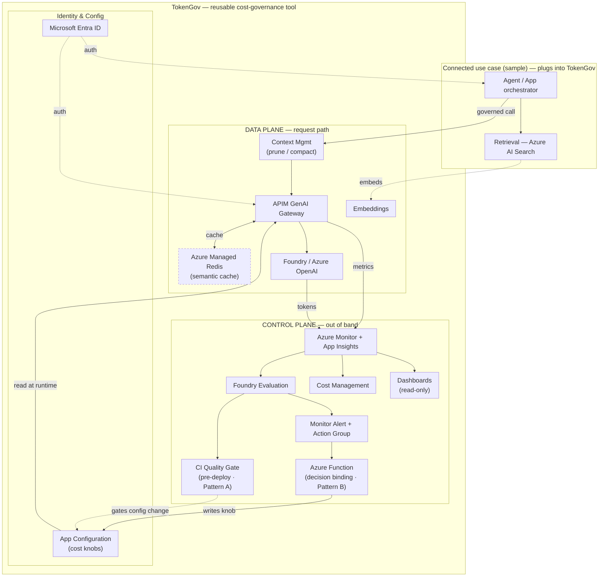

# Azure Solution Architecture — Eval-Gated Cost Governance for Agentic AI
### The reference architecture from [06](06_reusable-cost-governance-architecture.md), mapped to concrete Azure services (with live/deferred status)

*Compiled 2026-07-14. Turns the vendor-neutral reference architecture ([06](06_reusable-cost-governance-architecture.md)) and the Azure-first decision framework ([05](05_azure-first-cost-optimization-framework.md)) into a deployable Azure design. Deployment status reflects the `06_prototype/` build against subscription `MCAPS-iCSU-pd-America-sub`. Status legend: ✅ deployed · 🟡 deferred (in target architecture, not yet provisioned) · ⛔ blocked by subscription policy · 🔜 planned.*

> **Naming:** the reusable cost-governance tool is codenamed **TokenGov** (the two planes + config store + eval-gated loop). The agentic RAG app in the diagram is a **sample connected use case** that plugs into TokenGov for governed inference — it is *not* part of the core tool; any agent/app can connect the same way.

---

## 1. One-picture view

> Rendering tip: this diagram uses a larger base font (`init` directive below). If it still looks small in a narrow preview, open the file in the **Mermaid Live Editor** (paste the block) or widen the preview pane — the SVG scales to the container width. The full per-service detail is in the [§2 tables](#2-service-by-service-mapping), so the node labels are deliberately short.

**The loop (why this shape):** eval detects a quality regression on sampled traffic → Monitor alert fires the **Azure Function** → the Function tightens a knob in **App Configuration** → the **APIM gateway** reads the new knob on the next request → behaviour changes → eval re-measures. Aggressive cost-cutting, guardrailed — with **no code deploy**. This eval→enforcement binding is the one capability the market doesn't wire together natively ([04](04_critical-review-cost-control-plane.md)/[05](05_azure-first-cost-optimization-framework.md)).

**Two gates, one loop:** both read the same **Foundry Evaluation**. The **CI quality gate** (Pattern A, pre-deploy) blocks any cheaper config from *shipping* unless the golden-set score holds; the **runtime loop** (Pattern B, drawn above) auto-reverts a config that regresses in *production*. Context Management (prune/compact) sits in front of the gateway to attack the "context snowball" — the #1 agentic cost driver — before a token is ever billed.

---

## 2. Service-by-service mapping

### Data plane (request path)
| Architecture role | Azure service | SKU / detail | Status |
|---|---|---|---|
| Model layer | **Azure AI Foundry / Azure OpenAI** (`tokengov-aoai`) | `gpt-cheap`=gpt-5-nano, `gpt-premium`=gpt-5, GlobalStandard; native prompt caching automatic | ✅ deployed |
| Azure-native routing (benchmark arm) | **Foundry Model Router** (`model-router`) | 2025-11-18, GlobalStandard | ✅ deployed |
| Embeddings (cache + retrieval) | **Azure OpenAI** (`text-embed`) | text-embedding-3-small, GlobalStandard | ✅ deployed |
| Context management (prune / compact) | **Agent Framework middleware** / app-layer · *LLMLingua* | trims the "context snowball" **before** the gateway — the #1 agentic cost driver; a win-win (cost ↓, often quality ↑) | 🔜 planned (in-process prune in prototype) |
| Gateway / policy choke point | **Azure API Management** (`apim-tokengov-*`) | Developer; policies: `azure-openai-token-limit`, `azure-openai-emit-token-metric`, `authentication-managed-identity`, `set-backend-service` | ✅ service provisioning · 🔜 policies |
| **Semantic cache (vector store)** | **Azure Managed Redis** | Balanced B0+ (RediSearch/vector); backs APIM `azure-openai-semantic-cache-lookup/store` (score-threshold ≤0.2) | 🟡 **deferred** (in target arch; in-process cache used meanwhile) |

*(The agent orchestrator + AI Search retrieval belong to the **connected use case**, not TokenGov's data plane — see the table below.)*

### Control plane (out of band)
| Architecture role | Azure service | Detail | Status |
|---|---|---|---|
| Config store (the knobs) | **Azure App Configuration** (`tokengov-aoai-appcfg`) | route mode · cache threshold · budgets · min-quality; the control↔data contract | ✅ deployed |
| Telemetry sink | **Log Analytics + Application Insights** (`tokengov-aoai-law` / `-ai`) | token & cost metrics, traces; **sample it** (sleeper cost) | ✅ deployed |
| Evaluation engine | **Azure AI Foundry Evaluation** | golden-set + LLM-judge; CI gate (Pattern A) + continuous sampled eval (Pattern B); inline `RealJudge` today | 🟡 inline judge live · 🔜 managed eval |
| **Pre-deploy quality gate (Pattern A)** | **Foundry Evaluation in CI/CD** | blocks any cheaper config (route mode / cache threshold / prompt) from shipping unless the golden-set score holds — the *second* of the two gates | 🔜 planned |
| Decision binding (the "hands") | **Azure Function** (event-driven) | Monitor-alert-triggered; worst-segment ladder + hysteresis; writes knobs to App Config via MI | ⛔ blocked (see §4) |
| Alerting | **Azure Monitor alert + Action Group** | eval-regression / token-metric → fires the Function | 🔜 planned |
| **Dashboards (read-only view)** | **Azure Monitor Workbook** + **Foundry Agent Monitoring** | token / cost / quality over App Insights (`dashboard/workbook.json`); **observes only** — enforcement stays in the decision binding | 🟡 workbook defined · 🔜 import |
| FinOps | **Microsoft Cost Management** | RG budget + notifications + tags/chargeback | ✅ budget in IaC |
| Identity | **Microsoft Entra ID** | managed identities everywhere, `DefaultAzureCredential`; **no keys** | ✅ |

### Connected use case (sample — a consumer of TokenGov, not part of the core tool)
| Role | Azure service | Detail | Status |
|---|---|---|---|
| Agent orchestrator | **Foundry Agent Service** (hosted agent + AI Search tool) | the sample agentic RAG app; calls TokenGov's gateway for governed inference | 🔜 planned |
| Retrieval / knowledge | **Azure AI Search** (`tokengov-rag-6ayi7`) | Basic + semantic ranker; hybrid (vector + keyword); 5-book corpus | ✅ deployed (westeurope) |

---

## 3. The agentic-RAG workload (what exercises the governance)

A customer-support/research agent over a 5-book corpus (Project Gutenberg) makes the governance measurable on a realistic, high-token, quality-sensitive workload — the Tier-2 target from [06](06_reusable-cost-governance-architecture.md) §4:

1. **Ingest** — books → chunk → embed (`text-embed`) → **Azure AI Search** index (vector + semantic).
2. **Retrieve** — query embedded → hybrid + semantic-ranked passages → grounding context.
3. **Govern** — the **APIM gateway** routes easy→gpt-5-nano / hard→gpt-5, caps tokens, emits metrics; **Managed Redis** semantic-caches repeats.
4. **Evaluate** — Foundry eval scores answers vs. a book-derived golden set; the worst segment (hard synthesis) is where the cheap model drops detail → the gate has a real signal.
5. **Enforce** — regression → Function → App Config knob → gateway downshifts to safety. Headroom → push cost down again.

Three benchmark arms compared on `$ saved` **and** `judged quality`: premium baseline · our governance (route+cache+cap+eval-gate) · Foundry Model Router.

---

## 4. Security, networking & policy notes
- **Entra-only auth.** Every hop uses managed identity / `DefaultAzureCredential` — no API keys stored. APIM→models, Function→App Config, Search→models all via MI + least-privilege RBAC (Cognitive Services OpenAI User, App Configuration Data Owner, Search Index Data Reader/Contributor).
- **Subscription policy constraint (MCAPS).** Storage accounts are policy-forced to `allowSharedKeyAccess=false` + `publicNetworkAccess=Disabled`. This breaks Consumption Functions (file-share 403). **Compliant target:** the Function runs on **Flex Consumption with VNet integration + a private endpoint to storage + private DNS** (identity-based, keyless) — hence the ⛔ status; it's an environment constraint, not a design flaw.
- **Latency tax stacks** — gateway hop + router + semantic-cache embedding + retrieval can add 100–300 ms; measure before committing to real-time UX.
- **Governance tax is real** — the eval judge costs tokens; size `evaluation.sample_rate`, don't judge every response with a frontier judge.

---

## 5. Deployment topology (resource groups)
| RG | Region | Contents |
|---|---|---|
| `rg-tokengov` | swedencentral | AI Services + 4 model deployments · App Config · Log Analytics + App Insights · **APIM** · Function (target) · budget · Managed Redis (target) |
| `rg-tokengov-rag` | swedencentral (Search in westeurope) | **Azure AI Search** + book corpus · Foundry project/agent (target) |

Everything is reversible by deleting the two resource groups. IaC lives in `06_prototype/infra/` (`main.bicep`, `apim.bicep`, `platform.bicep`) + `rag/`.

---

## 6. Adoption tiers (scale the footprint to the workload — [06](06_reusable-cost-governance-architecture.md) §4)
| Tier | Turn on | Azure services |
|---|---|---|
| **0 — Hygiene** (all apps) | prompt caching + spend cap + token metrics | Azure OpenAI prompt caching · Cost Management budget · App Insights |
| **1 — Optimized** | + routing + semantic cache + CI eval gate | + APIM (token-limit, semantic-cache, emit-metric) + **Managed Redis** + Foundry eval (offline) |
| **2 — Governed** | + continuous eval + closed-loop enforcement + context pruning | + Foundry continuous eval + Monitor alert → **Azure Function** → App Config + AI Search RAG |

Low-volume apps stop at Tier 0 — correct, not a shortfall. The eval-gated machinery (Tier 2) is **insurance**, justified where a wrong answer is expensive, not by token savings alone.

---

## 7. Cost posture (illustrative)
Running: Azure OpenAI (per-token) · App Config · Log Analytics/App Insights · AI Search Basic (~$74/mo) · APIM Developer (~$50/mo). **Deferred:** Azure Managed Redis (~$60/mo, Balanced B0) — add when semantic-cache hit-rate justifies it (Tier 1+). Verify all figures on the live Azure pricing calculator; dollar amounts here are engineering estimates, not quotes.

---

**Bottom line:** the idea lands on Azure as **two planes joined by App Configuration and an eval-gated loop** — the **APIM GenAI gateway + Azure Managed Redis semantic cache + Foundry models + AI Search retrieval** capture the savings in the request path, while **Foundry Evaluation + a Monitor-alert-driven Azure Function + Cost Management** guard quality and attribute spend out of band. The single defensible piece — an eval verdict that *acts* on runtime cost — is built Azure-native as **Foundry eval → Monitor alert → Function → App Config → gateway**.
