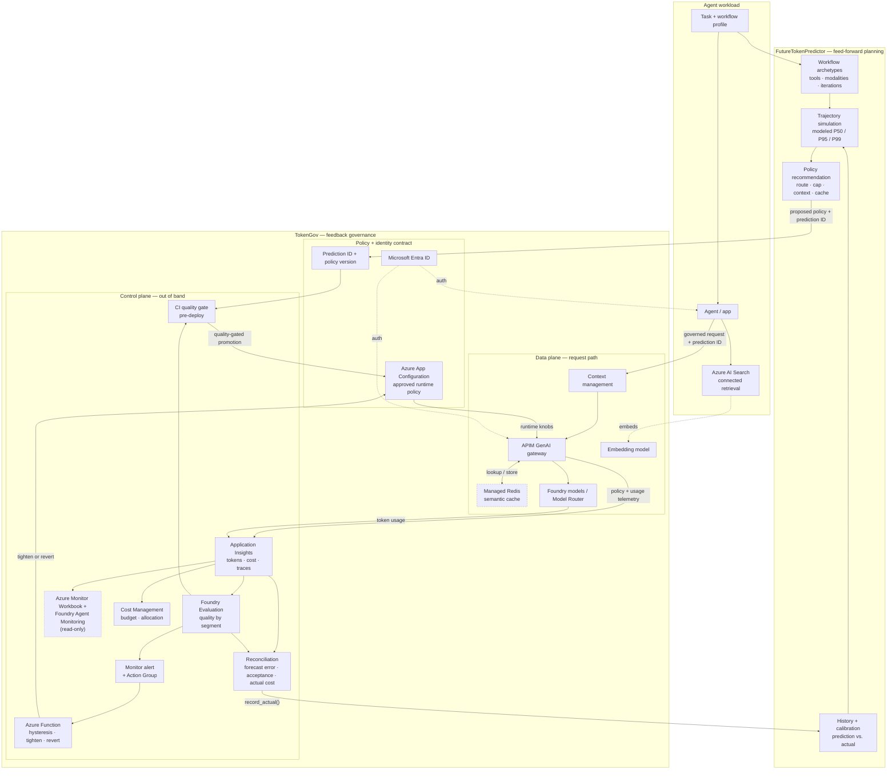

# Command Line Blog Pitch: Token Economics in Practice

**To:** commandlineblog@microsoft.com  
**Subject:** Command Line pitch: Predicting agent cost, governing it at runtime, and learning from actuals

Hi Command Line editorial team,

I'd like to propose a builder-focused post about putting **token economics** into practice for agentic AI systems. The post connects two research prototypes: **FutureTokenPredictor**, which forecasts an agent workflow's token and cost distribution before execution, and **TokenGov**, which governs cost at runtime while using evaluation to protect output quality.

**Working title:** *Predict Before, Govern After: Building a Closed-Loop Cost Controller for AI Agents*

## Core idea

Token prices alone are a poor economic model for agents. The price of reaching a fixed capability has fallen sharply,[^1][^2] but agents turn cheaper inference into longer, stochastic trajectories: growing context, repeated tool schemas, retries, reflection loops, and sub-agent fan-out.[^3][^4] In one study of agentic coding, repeated runs of the same agent on the same task varied in token cost by as much as 30x.[^3] That result is specific to coding agents, not a general multiplier. Optimizing average cost per token can therefore make the wrong system look efficient.

I use **Token Economics** to mean managing the unit economics of useful AI work under uncertainty. The useful unit is **cost per accepted task**, not cost per token. If $A=1$ means that a completed task passes its acceptance rubric, the long-run unit is approximately:

$$
U(\pi)=\frac{\mathbb{E}[C_{\text{task}}\mid\pi]}{P(A=1\mid\pi)}
$$

This follows the FinOps distinction between successful and unsuccessful AI outputs and its recommendation to connect cost with workload value.[^7] It is a project definition, not a quoted standard.

The formulation follows five steps. Agent studies make $C_{\text{task}}$ a random variable rather than a fixed estimate.[^3] Stochastic optimization supplies the expected-cost objective. FrugalGPT and CALM establish the LLM precedent for reducing cost or compute while preserving performance.[^11][^12] SLO practice treats acceptable service as an action-driving threshold, while Group DRO shows how averages can conceal group failures.[^13][^14] Charnes and Cooper's chance-constrained programming supplies the probabilistic budget limit.[^15]

That produces this controller approximation:

$$
\min_{\pi}\; \mathbb{E}[C_{\text{task}} \mid \pi]
$$

subject to:

$$
Q_s(\pi) \ge Q_{\min}\quad\forall s
$$

and:

$$
P(C_{\text{task}} > B) \le \epsilon
$$

Here, $\pi$ is policy; $C_{\text{task}}$ is total task cost; $Q_s$ is quality for supported segment $s$; $Q_{\min}$ is its floor; $B$ is budget; and $\epsilon$ is tolerated breach probability. This approximates minimizing $U(\pi)$ only while the quality gate stabilizes acceptance. In production, $Q_s$ needs a confidence-adjusted lower bound, sparse segments need minimum-sample rules, and the chance constraint is not a guarantee until forecast coverage is calibrated. The combination is project synthesis; its components are cited.

That changes the engineering problem from "pick the cheapest model" to:

1. Forecast a distribution, not a single token estimate.
2. Select a cost policy that is plausible for the task and its risk.
3. Enforce routing, context, cache, and budget controls during execution.
4. Evaluate whether the resulting output still meets a workload-specific quality floor.
5. Revert unsafe savings, reconcile predicted versus actual usage, and calibrate the next forecast.

The lifecycle is:

```text
Forecast -> Select policy -> Execute -> Evaluate -> Revert if needed
	^                                                   |
	+---------- Reconcile actuals and recalibrate ------+
```

FutureTokenPredictor is the **feed-forward** side: it models workflow archetypes and uncertain iteration counts to produce P50/P95-style planning estimates.[^5] TokenGov is the **feedback** side: its request path applies cost policy, while an out-of-band control plane evaluates outcomes and changes externalized policy when quality regresses.[^6] Runtime telemetry becomes calibration data for the next prediction. This framing and combined lifecycle are my systems interpretation, not language taken from either repository.

## What is nonobvious or technically interesting?

Most individual primitives already exist. FinOps practices cover forecasting, allocation, budgets, and anomaly management.[^7] Azure API Management provides token quotas, semantic caching, and token metrics; Foundry Model Router provides cost/balanced/quality routing modes; and Foundry cloud evaluation can score datasets and sampled production traces.[^8][^9][^10]

The interesting gap is the connected mechanism: **a forecast that becomes an enforceable policy, an evaluation verdict that can constrain or reverse a cost-saving action, and actual usage that improves the next forecast**. Neither prediction without control nor control without quality feedback is sufficient.

The implementation exposes several decisions:

- Why deterministic estimates hide stochastic loops and context growth.
- Why modeled P95 is not a calibrated guarantee until traces validate coverage.
- Why aggregate quality can hide regressions in a supported workload segment.
- Why hysteresis prevents policy oscillation and evaluation runs out of band.
- How prediction IDs, trace IDs, and actual usage form the reconciliation contract.
- Where the architecture failed in practice: an ungrounded live benchmark produced a meaningless quality score; APIM semantic caching required vector-capable Redis rather than a low-cost basic cache; and enterprise storage policy forced a rethink of the event-driven Function hosting design.

## Why should experienced builders care?

Teams need budgets before an agent runs and controls after it starts. Static estimates miss trajectory variance. Hard quotas can terminate useful work. Cost-first routing can silently weaken difficult segments. Observability explains damage only after it occurs.

The pattern treats cost as an objective subject to tail-spend tolerance and a quality floor. It also gives FinOps teams a stronger unit than token volume: forecast and actual cost per accepted task, segmented by workload and policy.

The demo will use Python, an MCP predictor, Bicep, and Azure calls to compare predicted P50/P95, actual cost, forecast error, and quality across premium, cost-first, and eval-gated policies, then call `record_actual()`.

The article will separate implementation from proposal. FutureTokenPredictor has workflow forecasts and SQLite calibration, but its percentiles are modeled and calibration tests synthetic. TokenGov has validated Azure calls, authentication, accounting, routing, judging, and simulated reversion. The grounded benchmark, managed evaluation, and telemetry reconciliation remain in progress.

## Reader takeaway / CTA

Readers will leave with a concrete implementation sequence for agent unit economics:

1. Define the unit of useful work, its quality floor, and its tail-spend tolerance.
2. Forecast a distribution for the agent trajectory and attach a prediction ID.
3. Translate the forecast into externalized routing, context, cache, and budget policy.
4. Gate cheaper settings on a golden set before deployment and sampled traces after deployment.
5. Revert through a bounded, auditable policy ladder when a workload segment regresses.
6. Reconcile actual tokens, cost, and quality with the forecast, then recalibrate.

## How the equation lands on Azure

The Azure architecture turns each term into an operating control: $\pi$ is externalized in App Configuration and enforced by APIM through routing, context, cache, and token policies; $C_{\text{task}}$ is reconstructed from gateway, model, and Application Insights telemetry; $Q_s$ comes from Foundry Evaluation over golden sets and sampled traces; and $B$ and $\epsilon$ become forecast-informed limits and alerts. A Monitor-triggered Function then tightens or reverts policy, closing the evaluation-to-enforcement loop without a code deployment.[^6]

## Implementation alignment checkpoint: Plan and Govern

The two Studio tabs implement the beginning of this controller, not the full mathematical controller. Plan is strongly aligned with the feed-forward cost model. Govern is aligned with authoritative policy binding and deterministic enforcement, but it does not yet optimize or continuously revise that policy from observed quality and tail risk.

| Formula element | Intended meaning | What is built now | Alignment |
|---|---|---|---|
| $\pi$ | A complete routing, model, context, cache, budget, and evaluation policy | Plan records the selected provider/model and an immutable forecast receipt. Govern loads one active policy from Azure App Configuration, validates its exact revision, and binds its ETag and SHA-256 hash to the decision. Govern does not yet compare candidate Azure policies. | Partial |
| $\mathbb{E}[C_{\text{task}}\mid\pi]$ | Expected end-to-end cost under a specific policy | Plan computes mean model cost per invocation and scaled daily, monthly, and annual exposure. Govern admits against the mean model cost per call. The forecast is based primarily on the selected offering and workload assumptions; it is not recomputed for each candidate routing/cache policy and excludes infrastructure and separately reported tool charges. | Partial |
| $A$ and $P(A=1\mid\pi)$ | A first-class accepted outcome and its probability under the policy | Runs record completed tasks and quality scores. They do not persist an accepted/rejected task outcome, and a quality score is not treated as an acceptance probability. | Missing |
| $U(\pi)$ | Expected cost per accepted task | Neither tab computes the ratio. Current reconciliation uses completed-task economics, which must not be labeled cost per accepted task. | Missing |
| $Q_s(\pi)$ | Quality for every workload segment | The run path evaluates quality by difficulty segment. The prototype reaction logic uses the worst segment, minimum sample counts, consecutive-breach hysteresis, and a bounded route ladder, but that logic is not connected to the Azure policy selected in Govern. | Implemented experimentally; not integrated |
| $Q_{\min}$ | Required segment-level quality floor | The authoritative policy carries `min_quality`, `min_segment_samples`, and `consecutive_breaches`. Govern displays the effective controls. Admission itself does not require evaluation evidence, and a completed run does not currently trigger policy publication or reversion. | Configured; not closed loop |
| $B$ | Cost budget or ceiling | Govern enforces a deterministic mean model-cost-per-call ceiling at admission. The runtime gateway also applies a per-tenant run budget with degrade or reject behavior. | Implemented approximation |
| $P(C_{\text{task}}>B)\le\epsilon$ | A calibrated bound on budget-breach probability | Plan exposes modeled token percentiles and modeled-high cost. It does not calculate breach probability for a supplied $B$, expose $\epsilon$, or validate percentile coverage against representative actuals. P95 must therefore not be described as a guaranteed 5% breach bound. | Missing |
| Reconciliation | Join forecast, policy, execution, outcomes, and actuals to improve the next decision | Prediction IDs, run IDs, policy versions, telemetry, and `record_actual()` provide the join and calibration path. Reconciliation is currently per completed task and does not include acceptance outcomes or policy-level tail coverage. | Partial |

The current product claim should therefore be: **Plan forecasts workload/model economics and Govern makes a provenance-pinned Azure admission decision. Together they establish the contracts needed by the research controller, but they do not yet minimize $U(\pi)$ or enforce the chance constraint.** The policy-candidate selector in [`costgov/policy.py`](06_prototype/costgov/policy.py) and the evaluation reaction logic in [`costgov/decision.py`](06_prototype/costgov/decision.py) demonstrate parts of the target behavior, but neither currently controls the policy shown in the Govern tab.

The shortest implementation path to full alignment is:

1. Define an accepted-task outcome by workload segment and persist it beside cost, quality, prediction ID, and policy revision.
2. Compute observed and forecast cost per accepted task without substituting mean quality for acceptance probability.
3. Require segment-level evaluation evidence, sample sufficiency, and confidence-aware quality bounds when comparing policy candidates.
4. Compute $P(C_{\text{task}}>B)$ from the forecast distribution, expose $B$ and $\epsilon$, and report empirical P50/P95 coverage after reconciliation.
5. Compare versioned policy candidates on the same workload forecast, then select the least expected-cost candidate satisfying both quality and chance constraints.
6. Surface the resulting evaluation decision and hysteresis state in Govern; keep publication as a separately authorized Azure/IaC action.
7. Pin model-catalog and pricing revisions alongside the existing receipt and policy provenance.

I expect **1,300-1,500 words**, with a lifecycle diagram, code excerpts, a benchmark table, and demo. It fits **Experiments and Projects** with a **How We Build** treatment.

I can suggest 2-3 peer reviewers for the technical review and will flag the idea to my GM/CVP before drafting. I will also coordinate any organization-specific CELA review required for the post and code assets.

## Selected evidence and provenance

[^1]: [Epoch AI, "LLM inference prices have fallen rapidly but unequally across tasks"](https://epoch.ai/data-insights/llm-inference-price-trends) - benchmark-specific fixed-capability price trends and caveats.
[^2]: [Stanford HAI, 2025 AI Index](https://hai.stanford.edu/ai-index/2025-ai-index-report) - reported 280-fold GPT-3.5-level inference-cost decline, November 2022 to October 2024.
[^3]: [Stanford Digital Economy Lab, "How are AI agents spending your tokens?"](https://digitaleconomy.stanford.edu/news/how-are-ai-agents-spending-your-tokens/) and its linked paper - coding-agent context accumulation, stochasticity, underestimation, and repeated-task variation.
[^4]: [Anthropic, "Effective context engineering for AI agents"](https://www.anthropic.com/engineering/effective-context-engineering-for-ai-agents) and [multi-agent research system](https://www.anthropic.com/engineering/multi-agent-research-system) - context growth, compaction, sub-agent use, and workload-specific economics.
[^5]: [FutureTokenPredictor repository](https://github.com/pdhiman_microsoft/FutureTokenPredictor) - workflow simulation, modeled percentiles, history, and calibration code. External accessibility remains to be confirmed.
[^6]: [TokenGov architecture](07_azure-solution-architecture.md) and [prototype](06_prototype/README.md) - project implementation evidence, not independent performance evidence.
[^7]: [FinOps Foundation, "FinOps for AI Overview"](https://www.finops.org/wg/finops-for-ai-overview/) - forecasting uncertainty, quality-aware baselines, allocation, budgets, and feedback loops.
[^8]: [Microsoft Learn, Azure API Management AI gateway](https://learn.microsoft.com/azure/api-management/genai-gateway-capabilities) - token limits, semantic caching, and token metrics.
[^9]: [Microsoft Learn, Model Router concepts](https://learn.microsoft.com/azure/ai-foundry/openai/concepts/model-router) - routing modes, model subsets, limitations, and described quality bands.
[^10]: [Microsoft Learn, Foundry cloud evaluation](https://learn.microsoft.com/azure/ai-foundry/how-to/develop/cloud-evaluation) - dataset, trace, sampled-production, and conversation evaluation. The enforcement binding is project code.
[^11]: [Chen, Zaharia, and Zou, "FrugalGPT" (2023)](https://arxiv.org/abs/2305.05176) - learned LLM cascades that optimize the quality-cost tradeoff under a budget.
[^12]: [Schuster et al., "Confident Adaptive Language Modeling" (NeurIPS 2022)](https://arxiv.org/abs/2207.07061) - adaptive compute allocation with sequence-level performance constraints.
[^13]: [Google, *Site Reliability Engineering*, "Service Level Objectives"](https://sre.google/sre-book/service-level-objectives/) - measurable quality thresholds, separate objectives for workload classes, error budgets, and action-triggering control loops.
[^14]: [Sagawa et al., "Distributionally Robust Neural Networks for Group Shifts" (ICLR 2020)](https://arxiv.org/abs/1911.08731) - worst-group optimization where average performance can hide atypical-group failures. TokenGov adapts the principle; it does not implement Group DRO training.
[^15]: [Charnes and Cooper, "Chance-Constrained Programming," *Management Science* 6(1), 1959](https://www.jstor.org/stable/2627476) - foundational treatment of planning and decision rules under probabilistic constraints.

Thanks for considering it,

[Your name]

---

## Editorial preparation notes (not part of the email)

### Provenance ledger

| Material | Provenance | Status in the pitch |
|---|---|---|
| Fixed-capability inference-price decline | Epoch AI and Stanford HAI | Cited external evidence; benchmark- and date-scoped |
| Stochastic trajectories, context accumulation, and 30x variation | Stanford Digital Economy Lab paper/report | Cited external evidence; explicitly scoped to agentic coding |
| Context engineering and multi-agent cost mechanisms | Anthropic engineering | Cited vendor engineering evidence; not generalized to every workload |
| FinOps planning, allocation, quality, and feedback practices | FinOps Foundation | Cited industry framework |
| Azure gateway, routing, and evaluation capabilities | Microsoft Learn | Cited product documentation; capability evidence, not workload performance evidence |
| FutureTokenPredictor behavior | `pdhiman_microsoft/FutureTokenPredictor` source and tests | Prior project implementation; public accessibility and real-trace calibration still need confirmation |
| TokenGov behavior and Azure architecture | This repository's prototype and architecture files | Current project implementation; deployment status is qualified |
| Cost-per-accepted-task definition | FinOps successful-output/value framing plus project synthesis | Ratio is an explicit project definition, not an external standard |
| Optimization formula | Stochastic optimization, LLM cost-quality work, SLOs, Group DRO, and chance constraints | Combination is project synthesis; components are cited; calibration assumptions are disclosed |
| Feed-forward predictor / feedback governor interpretation | Synthesis created for this project | Systems framing derived from the two implementations |
| Closed-loop lifecycle diagram | Synthesis created for this project | Original combination of prediction, enforcement, evaluation, and calibration |

No prose in the pitch was copied from an external article. External facts are paraphrased and cited. The project-specific definition, formula, controller framing, and combined lifecycle were synthesized during development of this pitch from the research and implementations listed above.

### Claims to preserve

- Token Economics is the umbrella engineering discipline; FutureTokenPredictor and TokenGov are modular implementations of its planning and control loops.
- The meaningful unit is cost per successful, quality-acceptable task, not token price or token count alone.
- The contribution is the forecast-policy-evaluation-reconciliation integration, especially the quality-to-enforcement binding, not the individual primitives.
- FutureTokenPredictor and TokenGov are research prototypes and reusable implementation patterns, not launched Microsoft products.
- The sample RAG application is a connected workload, not part of TokenGov's core architecture.
- Live Azure model calls and cost accounting have been validated; the complete grounded benchmark, managed runtime loop, and predictor-to-telemetry calibration are not yet finished.

### Claims to avoid

- "The first AI cost-control plane."
- "No existing tool does agent cost governance."
- Guaranteed savings or guaranteed quality preservation.
- Simulated savings percentages presented as production outcomes.
- Claims that prompt or semantic caching inherently preserves answer quality.
- Calling modeled P50/P95 values empirically calibrated confidence intervals.
- Generalizing coding-agent or research-agent token multipliers to all agentic workloads.
- Treating provider price comparison as evidence of equivalent output quality.

### Assets needed before draft submission

- Sanitized architecture diagram from `07_azure-solution-architecture.md` without internal resource names or deployment-status clutter.
- A lifecycle diagram showing prediction as feed-forward control, TokenGov as feedback control, and telemetry as the calibration path.
- A compact integration that carries a prediction ID into TokenGov telemetry and calls FutureTokenPredictor's `record_actual()` path.
- Reproducible grounded RAG results showing predicted P50/P95, actual cost, forecast error, and quality by policy.
- A compact code excerpt showing worst-segment gating, hysteresis, and the bounded route ladder.
- One failure/result table separating measured, simulated, deferred, and blocked components.
- Confirm that both repositories are externally accessible, or prepare one sanitized public sample if publication approval permits release.

### Architecture diagram — version 2: FutureTokenPredictor + TokenGov

This is a second conceptual view for the article. It does not replace or modify the Azure-specific TokenGov diagram in [07](07_azure-solution-architecture.md). FutureTokenPredictor remains outside the request path: it forecasts and recommends a policy before execution, while TokenGov owns runtime enforcement and quality-triggered reversion. Prediction IDs connect forecasts to actual telemetry so calibration can improve subsequent estimates.



**Boundary and lifecycle:** FutureTokenPredictor estimates the distribution $F_{\pi}(C_{\text{task}})$ and proposes $\pi$; TokenGov admits only a quality-gated policy, enforces it, measures $C_{\text{task}}$ and $Q_s$, and reverts when constraints fail. Reconciliation joins the prediction ID, policy version, trace, actual cost, and acceptance result before calling `record_actual()`. The Workbook and Foundry Agent Monitoring dashboard remains read-only, while Cost Management supplies budget and allocation visibility; neither can mutate runtime policy. The proposed integration path is therefore:

```text
Forecast -> Recommend -> Quality-gated promotion -> Enforce -> Evaluate
	^                                                        |
	+------ Reconcile prediction, actual cost, and quality ---+
```

### Recommended peer-review coverage

- Agent evaluation and benchmark methodology.
- Forecasting methodology and statistical interpretation of the modeled percentiles.
- Azure architecture, identity, and event-driven control path.
- FinOps/cost-accounting assumptions and claims.