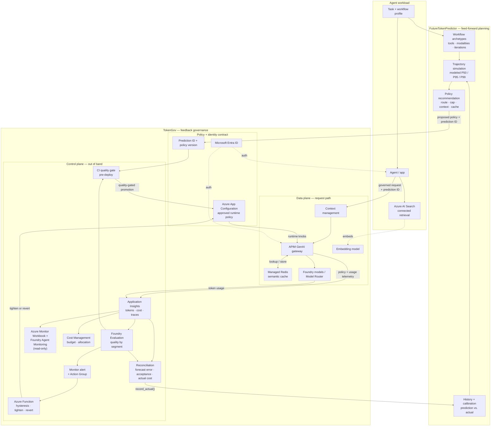

# Token Economics in Practice: Predicting and Governing AI Agent Cost on Azure

*How we turned a cost equation into an operating control loop — a forecast that becomes an enforceable policy, an evaluation verdict that can reverse a cost-saving action, and actual usage that improves the next forecast.*

> **What this is.** A field report from two research prototypes — **FutureTokenPredictor** and **TokenGov** — built to make agent unit economics operable on Azure. These are reusable implementation patterns, not launched Microsoft products. Where the architecture is proven, I say so; where it is still a proposal, I label it. The most useful parts of this post are the places where the design met production reality and had to change.

## The cheap-token trap

The price of reaching a fixed capability has fallen sharply — Stanford's AI Index reported a roughly 280-fold drop in the cost of GPT-3.5-level inference between late 2022 and late 2024, and Epoch AI tracks steep (if uneven) per-benchmark price declines.[^1][^2] The intuitive conclusion is that agents are getting cheaper to run. The operational reality is the opposite.

Agents turn cheaper inference into **longer, stochastic trajectories**: growing context windows, repeated tool schemas, retries, reflection loops, and sub-agent fan-out.[^3][^4] In one study of agentic coding, repeated runs of the *same* agent on the *same* task varied in token cost by as much as **30×**.[^3] (That figure is specific to coding agents — it is not a universal multiplier.) When a single logical task can cost you thirty times more depending on the path the agent takes, optimizing *average cost per token* will happily make the wrong system look efficient.

So the leading question of token economics isn't "what's the token price?" It's **"what does it cost to get one accepted unit of useful work — and how confident am I in that number before the agent runs?"**

## The unit that actually matters: cost per accepted task

I use **token economics** to mean managing the unit economics of useful AI work under uncertainty. The meaningful unit is **cost per accepted task**, not cost per token.

Let `A = 1` mean a task passed its acceptance rubric. The long-run unit cost of a policy `π` is approximately:

$$
U(\pi)=\frac{\mathbb{E}[C_{\text{task}}\mid\pi]}{P(A=1\mid\pi)}
$$

The numerator is expected task cost; the denominator is the probability the output is actually acceptable. This follows the FinOps distinction between successful and unsuccessful AI outputs and the recommendation to connect cost with workload value.[^7] It is a working definition for this project, not a quoted standard — but it reframes the engineering problem immediately. A "cheaper" policy that halves cost while dropping acceptance from 95% to 70% is **more expensive per accepted task**, and only this ratio makes that visible.

That reframing turns "pick the cheapest model" into a five-step discipline:

1. **Forecast** a distribution, not a single token estimate.
2. **Select** a cost policy that is plausible for the task and its risk.
3. **Enforce** routing, context, cache, and budget controls during execution.
4. **Evaluate** whether the output still clears a workload-specific quality floor.
5. **Revert** unsafe savings, reconcile predicted vs. actual usage, and calibrate the next forecast.

```text
Forecast -> Select policy -> Execute -> Evaluate -> Revert if needed
    ^                                                   |
    +---------- Reconcile actuals and recalibrate ------+
```

## From a metric to a controller

If cost is a random variable, the objective is a stochastic one. Minimize *expected* task cost subject to two constraints — a quality floor on every workload segment, and a bound on how often you blow the budget:

$$
\min_{\pi}\; \mathbb{E}[C_{\text{task}} \mid \pi]
$$

subject to a per-segment quality floor:

$$
Q_s(\pi) \ge Q_{\min}\quad\forall s
$$

and a chance constraint on budget breach:

$$
P(C_{\text{task}} > B) \le \epsilon
$$

Here `π` is the policy; `C_task` is total task cost; `Q_s` is quality for a supported segment `s` with floor `Q_min`; `B` is the budget; and `ε` is the tolerated breach probability. The pieces are all borrowed — stochastic optimization for the expected-cost objective; FrugalGPT and Confident Adaptive Language Modeling for the LLM precedent of cutting cost while preserving performance;[^11][^12] SRE service-level objectives for treating "acceptable service" as an action-driving threshold and Group DRO for the insight that *averages hide group failures*;[^13][^14] and Charnes–Cooper chance-constrained programming for the probabilistic budget limit.[^15] The synthesis — wiring them into one agent controller — is the contribution.

Two honest caveats travel with this controller: `Q_s` needs a confidence-adjusted lower bound (sparse segments shouldn't trigger changes on two samples), and the chance constraint is **not a guarantee** until your forecast's percentile coverage is calibrated against real traces. A modeled P95 is a planning estimate, not a promised 5% breach bound.

## Two halves of the loop: feed-forward and feedback

The controller splits cleanly into a planning half and a runtime half.

- **FutureTokenPredictor is the feed-forward side.** It models workflow archetypes and uncertain iteration counts to produce P50/P95-style planning estimates *before execution*, and recommends a policy.[^5] It stays **outside the request path**.
- **TokenGov is the feedback side.** Its request path applies the admitted cost policy; an out-of-band control plane evaluates outcomes and changes externalized policy when quality regresses.[^6] Runtime telemetry then flows back to the predictor as calibration data for the next forecast.

Neither half is sufficient alone. Prediction without control is a spreadsheet. Control without quality feedback silently degrades your hardest segments. The value is the **wire between them**: a forecast that becomes an enforceable policy, an eval verdict that can reverse a cost action, and actuals that sharpen the next forecast.

## How the equation lands on Azure

This is where token economics stops being a metric and becomes architecture. Each term in the controller maps to a concrete Azure control:

| Controller term | Azure control in practice |
|---|---|
| `π` (policy) | Externalized in **Azure App Configuration**; enforced by **API Management** GenAI gateway (routing, context, cache, token policies) |
| `E[C_task \| π]` (expected cost) | Reconstructed from APIM gateway, model, and **Application Insights** telemetry |
| `Q_s` (segment quality) | **Azure AI Foundry evaluation** over golden sets and sampled production traces |
| `B`, `ε` (budget, breach tolerance) | Forecast-informed limits and **Azure Monitor** alerts; **Cost Management** for allocation |
| Reversion | A **Monitor-triggered Azure Function** tightens or reverts policy in App Configuration — closing the eval-to-enforcement loop **without a code deployment** |

Most of these primitives already exist and are individually documented: APIM provides token quotas, semantic caching, and token metrics; Foundry Model Router offers cost/balanced/quality routing modes; Foundry cloud evaluation scores datasets and sampled traces.[^8][^9][^10] The interesting gap they *don't* close on their own is the connected mechanism — an evaluation verdict that can constrain or reverse a cost-saving action, and actual usage that improves the next forecast.

Here is the full two-plane view. FutureTokenPredictor forecasts and recommends *before* execution; TokenGov owns runtime enforcement and quality-triggered reversion; prediction IDs join forecasts to actual telemetry so calibration can improve the next estimate.



The read-only dashboards (Azure Monitor Workbook, Foundry Agent Monitoring) *observe* — they cannot mutate runtime policy. Only the eval-triggered Function can, and only through the reviewed App Configuration policy. That boundary is deliberate: a dashboard shows drift; the Function acts on it.

## What actually happened when we built it

The honest part. Building this against real Azure exposed the gap between a clean equation and a running system — three of them worth passing on:

- **An ungrounded live benchmark produced a meaningless quality score.** Without a grounded reference (retrieved passages the judge could check against), the LLM-as-judge had nothing to grade, and the "quality" number was noise. Grounding the evaluation isn't optional decoration — it's what makes the `Q_s` term real.
- **APIM semantic caching needed vector-capable Redis, not a low-cost basic cache.** The architecture diagram says "semantic cache"; the invoice says "Azure Managed Redis with vector support." Semantic caching is a similarity search, and similarity search needs vectors. Budget for the tier that actually does the job.
- **Enterprise storage policy forced a rethink of the event-driven Function hosting.** The tidy "Monitor alert → Function → revert" path collided with organizational constraints on Function storage, and the hosting design had to change. The control loop survived; its plumbing didn't.

None of these break the pattern. All of them are the kind of thing you only learn by wiring the equation to a real subscription — which is exactly why "in practice" belongs in the title.

## An implementation-alignment checkpoint (the parts that are real vs. proposed)

The prototype's two operator surfaces — **Plan** and **Govern** — implement the *beginning* of this controller, not the whole thing. Being precise about that boundary matters more than a rounded-up demo:

| Controller element | What is built today | Alignment |
|---|---|---|
| `π` — full routing/model/context/cache/budget/eval policy | Plan records the selected model and an immutable forecast receipt; Govern loads one active Azure App Configuration policy, validates its exact revision, and binds its ETag + SHA-256 to the decision. It does **not** yet compare candidate policies. | Partial |
| `E[C_task \| π]` — expected cost under a policy | Plan computes mean model cost per invocation scaled to daily/monthly/annual exposure; Govern admits against that mean. Not recomputed per candidate routing/cache policy; excludes infrastructure and separately-billed tool charges. | Partial |
| `A`, `P(A=1 \| π)` — accepted outcome + probability | Runs record completed tasks and quality scores, but do **not** persist an accepted/rejected outcome, and a quality score is not treated as an acceptance probability. | Missing |
| `U(π)` — cost per accepted task | Not yet computed. Current reconciliation uses completed-task economics, which must **not** be labeled cost per accepted task. | Missing |
| `Q_s` — per-segment quality | The run path evaluates quality by difficulty segment, with worst-segment gating, minimum-sample rules, consecutive-breach hysteresis, and a bounded route ladder — but that logic isn't yet wired to the Azure policy Govern selects. | Built experimentally; not integrated |
| `B`, `P(C_task > B) ≤ ε` — budget + breach bound | A deterministic mean-cost-per-call ceiling is enforced at admission and a per-tenant run budget at runtime. Breach *probability* against a supplied `B` is not yet computed, and P95 must **not** be described as a guaranteed 5% breach bound. | Approximation / missing |

The honest current claim: **Plan forecasts workload/model economics, and Govern makes a provenance-pinned Azure admission decision. Together they establish the contracts the controller needs — but they do not yet minimize `U(π)` or enforce the chance constraint.**

## Where to start if you're building this

The value isn't the individual primitives — FinOps forecasting, APIM quotas, Foundry evaluation all exist. It's the sequence that connects them into a loop:

1. **Define the unit of useful work**, its per-segment quality floor, and its tail-spend tolerance. Persist an accepted/rejected outcome beside cost, quality, prediction ID, and policy revision.
2. **Forecast a distribution** for the agent trajectory and attach a prediction ID — not a single point estimate.
3. **Translate the forecast into externalized policy** (routing, context, cache, budget) in App Configuration, enforced by APIM.
4. **Gate cheaper settings** on a golden set before deployment and on sampled traces after — with grounded references so the eval means something.
5. **Revert through a bounded, auditable ladder** when a workload *segment* regresses (not just when the mean does).
6. **Reconcile** actual tokens, cost, and quality against the forecast, then recalibrate — and report empirical P50/P95 coverage so your percentiles earn their confidence.

Teams need budgets *before* an agent runs and controls *after* it starts. Static estimates miss trajectory variance; hard quotas terminate useful work; cost-first routing silently weakens hard segments; observability explains damage only after it happens. Treating cost as an objective **subject to a tail-spend tolerance and a segment-level quality floor** is what closes those gaps — and it gives FinOps teams a stronger unit than token volume: *forecast and actual cost per accepted task, segmented by workload and policy.*

---

### References

[^1]: Epoch AI, ["LLM inference prices have fallen rapidly but unequally across tasks."](https://epoch.ai/data-insights/llm-inference-price-trends) Benchmark-specific, date-scoped price trends and caveats.
[^2]: Stanford HAI, [2025 AI Index Report.](https://hai.stanford.edu/ai-index/2025-ai-index-report) ~280-fold GPT-3.5-level inference-cost decline, Nov 2022–Oct 2024.
[^3]: Stanford Digital Economy Lab, ["How are AI agents spending your tokens?"](https://digitaleconomy.stanford.edu/news/how-are-ai-agents-spending-your-tokens/) Coding-agent context accumulation, stochasticity, and repeated-task variation.
[^4]: Anthropic, ["Effective context engineering for AI agents"](https://www.anthropic.com/engineering/effective-context-engineering-for-ai-agents) and ["Building a multi-agent research system."](https://www.anthropic.com/engineering/multi-agent-research-system) Context growth, compaction, and sub-agent economics.
[^5]: FutureTokenPredictor — workflow simulation, modeled percentiles, and calibration code (research prototype).
[^6]: TokenGov architecture and prototype — project implementation evidence, not independent performance evidence.
[^7]: FinOps Foundation, ["FinOps for AI Overview."](https://www.finops.org/wg/finops-for-ai-overview/) Forecasting uncertainty, quality-aware baselines, allocation, budgets, feedback loops.
[^8]: Microsoft Learn, [Azure API Management AI gateway capabilities.](https://learn.microsoft.com/azure/api-management/genai-gateway-capabilities) Token limits, semantic caching, token metrics.
[^9]: Microsoft Learn, [Model Router concepts.](https://learn.microsoft.com/azure/ai-foundry/openai/concepts/model-router) Routing modes, model subsets, limitations.
[^10]: Microsoft Learn, [Foundry cloud evaluation.](https://learn.microsoft.com/azure/ai-foundry/how-to/develop/cloud-evaluation) Dataset, trace, and sampled-production evaluation.
[^11]: Chen, Zaharia, and Zou, ["FrugalGPT" (2023).](https://arxiv.org/abs/2305.05176) Learned LLM cascades optimizing the quality-cost tradeoff under budget.
[^12]: Schuster et al., ["Confident Adaptive Language Modeling" (NeurIPS 2022).](https://arxiv.org/abs/2207.07061) Adaptive compute with sequence-level performance constraints.
[^13]: Google, [*Site Reliability Engineering*, "Service Level Objectives."](https://sre.google/sre-book/service-level-objectives/) Measurable thresholds, per-class objectives, error budgets, action-triggering loops.
[^14]: Sagawa et al., ["Distributionally Robust Neural Networks for Group Shifts" (ICLR 2020).](https://arxiv.org/abs/1911.08731) Worst-group optimization; average performance hides atypical-group failure. TokenGov adapts the principle; it does not implement Group DRO training.
[^15]: Charnes and Cooper, ["Chance-Constrained Programming," *Management Science* 6(1), 1959.](https://www.jstor.org/stable/2627476) Foundational decision rules under probabilistic constraints.

---

*FutureTokenPredictor and TokenGov are research prototypes and reusable implementation patterns, not launched Microsoft products. Live Azure model calls and cost accounting have been validated; the complete grounded benchmark, managed runtime loop, and predictor-to-telemetry calibration are still in progress. Modeled P50/P95 values are planning estimates, not empirically calibrated confidence intervals.*
