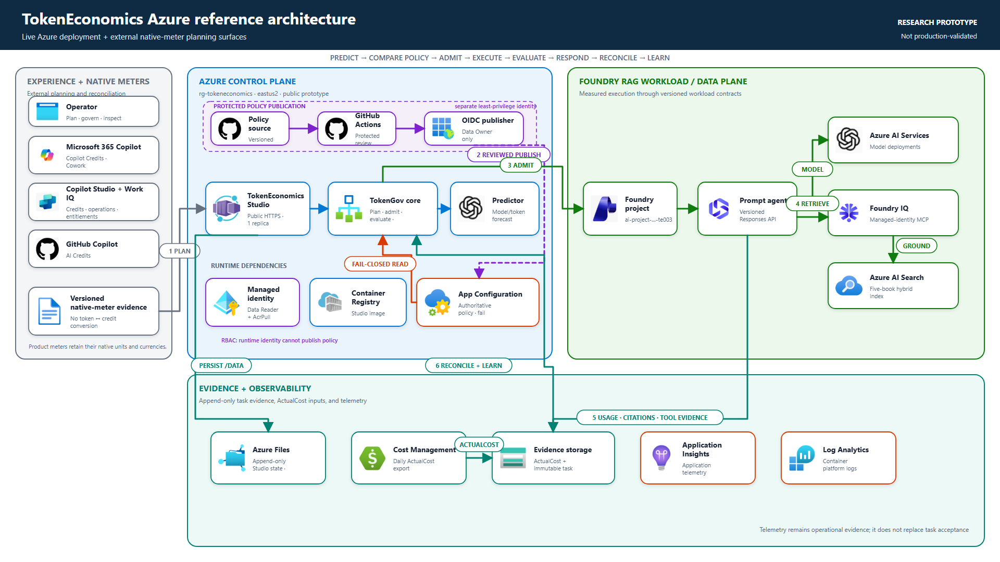

# TokenEconomics

**AI unit economics: predict, govern, learn.**

Per-token model prices keep falling, yet agent bills can still rise because agents execute
long, branching, stochastic trajectories. TokenEconomics plans and governs the unit that
maps to business value: **cost per accepted task**, not cost per token.

```text
predict -> compare policy -> admit -> execute -> evaluate -> respond -> reconcile -> learn
```

The architecture separates two concerns:

- **FutureTokenPredictor** provides feed-forward workload and model-cost forecasts before
  execution.
- **TokenGov** connects immutable forecasts to policy, runtime evidence, quality
  evaluation, bounded response, and reconciliation.

TokenEconomics composes existing Azure and Microsoft primitives rather than replacing
them. Current outputs are research-prototype evidence, not guaranteed savings, quality,
production readiness, or calibrated tail-risk claims.

## Current scope

Studio now presents four operator workspaces:

```text
Home -> Forecast -> Policy -> Execute & Review -> Performance & Decisions
```

The underlying governance lifecycle remains:

```text
predict -> compare policy -> admit -> execute -> evaluate -> respond -> reconcile -> learn
```

**Forecast** models Foundry usage, infrastructure, and commercial meter stacks for
Microsoft Copilot, Copilot Studio, Cowork, Work IQ, and GitHub Copilot. Subscriptions,
entitlements, Microsoft Copilot Credits, GitHub AI Credits, model tokens, and Azure
resource meters remain separate evidence; TokenEconomics does not invent a conversion
between them. New forecasts preserve versioned workload analysis, pricing evidence,
infrastructure assumptions, meter ledgers, and immutable receipt identities.

**Policy** exposes the exact fail-closed Azure App Configuration authority and supports
reviewed policy change requests without giving the browser publication credentials.
**Execute & Review** joins admitted execution, Foundry evaluation, and append-only human
acceptance. **Performance & Decisions** combines governance, accepted-task economics,
reconciliation, and learning while preserving their distinct evidence boundaries.

The repository also contains a policy-bound Microsoft Foundry RAG adapter that captured
one measured reference trajectory through a Foundry prompt agent, Foundry IQ knowledge
base, MCP retrieval, Azure AI Search, cited synthesis, and provider-reported token usage.
Workload-specific Foundry, Search, MCP, and corpus translation remains under `rag/`;
reusable TokenGov contracts remain under `costgov/`.

### Latest progress

| Milestone | Status | Evidence boundary |
|---|---|---|
| Studio Plan release hardening | Complete | Experience-led intake, deterministic workload analysis, immutable schema-5 receipts, and saved-plan restoration |
| Copilot and GitHub economics | Complete | Subscriptions, entitlements, Microsoft Copilot Credits, GitHub AI Credits, model tokens, and resource meters remain separate |
| Foundry model release `2026-08-25.2` | Complete | 98 sourced OpenAI/Anthropic offerings; 50 verified coordinator models are selectable |
| Framework-neutral trajectory contract | Complete | Stable workload, task, trajectory, segment, prediction, policy, run, and trace identities |
| Foundry RAG adapter (TE-003) | Complete | Live report `RPT-20260825-3C4ABA0C` preserves one policy-bound deployed trajectory |
| Experiment manifest (TE-004) | Complete | `experiment-manifest.v1` pins shared evidence and machine-readable arm differences |
| Accepted-task outcomes (TE-005) | Complete | Segment-specific rules produce immutable `accepted`, `rejected`, or `inconclusive` evidence distinct from raw scores |
| Multi-meter trajectory ledger (TE-006) | Complete | Native quantities, currencies, entitlements, allocations, unknown costs, and coverage-aware reconciliation remain explicit |
| Accepted-task Observe economics (TE-007) | Complete | Read-only denominator, segment, native-meter, entitlement, priced-cost, and uncovered-cost views reopen verified immutable run evidence |
| Immutable policy candidates (TE-008) | Complete | Hash-bound candidate revisions validate control authority/capability without mutating active Azure policy |
| Copilot/native-meter forecasting | Complete prototype | Microsoft Copilot Credits, GitHub AI Credits, entitlements, model tokens, and infrastructure charges remain separate |
| Human quality acceptance | Complete prototype | Foundry grades remain advisory; reviewers append `accepted`, `rejected`, or `inconclusive` outcomes |
| Campaign authorization | Published | Azure policy `2026-09-18.campaign.1` authorizes bounded 25-case, 100-repetition measurement |
| Repeated quality campaign | Paused | First repetition preserved 17 responses; eight undispatched calls require a tested no-replay continuation contract |
| Cross-report portfolio Home | Complete prototype | Read-only evidence readiness, attention queue, and decision matrix across reports |
| Hosted Studio release | Deployed | Container App revision `ca-tokeneconomics-studio--accumulated-20260918` |

The current measured local regression boundary is **1,428 TokenEconomics tests passed**
with one skipped and **530 FutureTokenPredictor tests passed** through its evidence
runner. This proves the local contracts and modeled
calculations at the tested revision; it is not production-capacity evidence.

The remaining end-to-end work is material: safe within-repetition continuation,
representative segment samples, complete-trajectory cost, calibrated budget-risk
evidence, bounded response/reversion, independent billing reconciliation, demonstrated
predictor improvement, and a decision-grade non-Foundry portability proof.

## Architecture at a glance



The architecture preserves two planes:

| Plane | Responsibility |
|---|---|
| Control plane | Studio, FutureTokenPredictor, TokenGov policy comparison, evaluation, decisions, reconciliation, and learning |
| Workload/data plane | The Foundry prompt agent, model calls, Foundry IQ retrieval, Azure AI Search, and runtime evidence emission |

Azure App Configuration is the authoritative policy source and is read fail-closed.
GitHub Actions publishes reviewed policy through a separately authorized OIDC identity.
The Studio runtime uses managed identity with narrowly scoped App Configuration reader,
ACR pull, and cost-export reader roles. Azure Files stores persistent Studio evidence;
Application Insights, Log Analytics, Cost Management, and evidence stores support
observability and reconciliation.

Microsoft 365 and Copilot product meters enter Forecast as versioned native-meter
evidence. They do not become Azure TokenGov runtime controls, and workload-specific RAG
logic remains under `rag/` rather than in reusable `costgov/` core.

Editable [draw.io](docs/architecture/token-economics-azure-architecture.drawio) and
[Excalidraw](docs/architecture/token-economics-azure-architecture.excalidraw) versions,
an [SVG](docs/architecture/token-economics-azure-architecture.svg), a
[PowerPoint slide](docs/architecture/token-economics-azure-architecture.pptx), and the
[Mermaid source](docs/architecture/token-economics-azure-architecture.mmd) are included.

## Run Studio locally

Prerequisites: **Python 3.11+**, **git**, and PowerShell.

```powershell
git clone https://github.com/pd-illinois/TokenEconomics.git
cd TokenEconomics
python -m venv .venv
.\.venv\Scripts\python.exe -m pip install --upgrade pip
.\.venv\Scripts\python.exe -m pip install -e ".\FutureTokenPredictor[dev]"
.\.venv\Scripts\python.exe .\studio.py
```

Open <http://127.0.0.1:8765>.

Studio prioritizes this checkout's `FutureTokenPredictor\src` for in-process
forecast validation and learning, matching the CLI and predictor MCP process.
An older globally installed or sibling editable predictor must not supply those
modules. Restart Studio after updating runtime code; refreshing the browser does
not reload Python imports. Missing feedback dependencies return an explicit
HTTP 503 error rather than an empty connection or missing-evidence result.

Studio stores local reports, plans, runs, and reconciliation evidence in ignored
root-level runtime directories. These files survive server restarts but are not committed.

### Local Azure policy authentication

When using multiple Azure tenants, the CLI's default account or another developer
credential can return a token that the policy store rejects with `Unauthorized`.
For local policy reads, set `TOKENGOV_POLICY_AZURE_CLI_SUBSCRIPTION` in `.env` to
the subscription UUID of the already authenticated account that can read the
configured App Configuration store. This selects `AzureCliCredential(subscription=...)`
for policy reads only, without changing the global CLI default or other Azure clients.

For local deployed-agent and Q&A evaluation operations, set
`TOKENGOV_RAG_AZURE_CLI_SUBSCRIPTION` to the intended subscription UUID. This
pins the same already authenticated Azure CLI account for agent inventory,
policy rechecks during a batch, source response calls, evaluation-project
inventory, and evaluation retrieval. It prevents another cached developer
credential from silently winning the default chain. The setting is rejected in
hosted runtimes, which continue to require managed identity.
Restart Studio after changing `.env`; inherited environment variables take precedence.

Leave this setting unset in hosted environments, which retain their default
runtime credential chain. It does not grant RBAC permissions, change the Azure
endpoint/key/label, renew policy, or fall back to a local file. If the selected
account needs an interactive login, authenticate to its tenant using that account.

## Foundry RAG user guide

The Foundry RAG reference workload verifies more than a successful model response. It
binds a versioned Plan receipt to the authoritative Azure App Configuration policy,
executes the pinned Microsoft Foundry prompt agent and Foundry IQ MCP retrieval path,
records provider-reported usage and citations in a complete trajectory envelope, applies
segment-specific acceptance rules, and preserves the resulting meter and governance
evidence. Foundry/RAG-specific translation stays under `rag/`; reusable contracts stay
under `costgov/`.

For a field-by-field, screenshot-based walkthrough of every Studio route and lifecycle
view, see the [TokenEconomics Studio user guide](docs/TOKEN_STUDIO_USER_GUIDE.md) or its
[formatted PDF edition](docs/TOKEN_STUDIO_USER_GUIDE.pdf).

### What each test proves

| Test | Purpose | Evidence classification |
|---|---|---|
| One-task smoke proof | Confirms policy admission, Foundry agent execution, MCP retrieval, citations, usage capture, immutable persistence, and reopen integrity | Measured live, one complete trajectory |
| 120-task baseline | Evaluates 60 easy and 60 hard tasks with decision-grade segment sample sizes | Measured live cohort |
| Reduced-retrieval windows | Demonstrates two-window quality hysteresis and admission blocking | Measured live regression response |
| Studio review | Reopens existing immutable evidence without making new Foundry calls | Read-only evidence review |

The smoke proof is not decision-grade. The cohort test is the complete evaluation case
and makes billable Foundry calls, so do not rerun it merely to inspect existing evidence.

### Prerequisites

1. Install the local environment from [Run Studio locally](#run-studio-locally).
2. Authenticate to the tenant and select the TokenEconomics subscription:

   ```powershell
   az login --tenant 6435fdd8-5f2e-4832-8f52-cc4e715685f6
   az account set --subscription a91cc1ba-bd19-43a7-90ea-120794c0fbc6
   az account show --query "{name:name,id:id,tenantId:tenantId}" -o table
   ```

3. Confirm that your identity can read `appcs-xbk6ickycmp22`, invoke the Foundry
   project and agent, and read the Foundry IQ/Search path. Authentication is Entra ID;
   no API key belongs in `.env`.
4. Confirm the authoritative policy is readable:

   ```powershell
   $env:AZURE_APPCONFIG_ENDPOINT = "https://appcs-xbk6ickycmp22.azconfig.io"
   $env:TOKENGOV_POLICY_KEY = "tokengov:policy"
   $env:TOKENGOV_POLICY_LABEL = "te003-live-v2"
   $env:TOKENGOV_POLICY_SOURCE = "azure"
   .\.venv\Scripts\python.exe -c "from costgov.policy_store import load_policy_from_environment; p=load_policy_from_environment(); print(p.document['version'], p.provenance['etag'])"
   ```

The current published revision is `2026-09-18.campaign.1` with ETag
`1c72Cdf_wHabwrCb7UarYctyFlgNFVTfWZDBKTEqku0`. A different revision is not
automatically wrong, but it means the resulting proof is bound to different policy
evidence and must not be compared as if it used the current campaign authority.

### Run the one-task measured smoke proof

This command creates a new Plan and report, admits the exact receipt against Azure
policy, invokes the pinned agent, persists the trajectory, and reopens it:

```powershell
.\.venv\Scripts\python.exe .\scripts\run_te003_live_test.py `
  --agent-name tokengov-books-rag-agent `
  --agent-version 4 `
  --policy-label te003-live-v2
```

A successful result exits with code `0` and prints JSON containing:

- `evidence_status: "measured_live"`;
- `report_id`, `plan_id`, `receipt_id`, `handoff_id`, `run_id`, and `trajectory_id`;
- the exact `policy_version` and `policy_etag`;
- a trajectory `content_hash`;
- `reopened: true`;
- a cited `response_text`.

Treat the test as failed if admission is rejected, MCP retrieval is absent, the response
lacks grounding/citations, provider usage is unavailable, or the persisted trajectory
does not reopen byte-equivalently through its contract.

### Run or resume the decision-grade baseline

The complete baseline performs 120 billable tasks. Give every new execution a stable,
unique run ID; rerunning a completed ID reopens its result instead of duplicating calls:

```powershell
.\.venv\Scripts\python.exe .\rag\run_live_policy_evaluation.py `
  --run-id te009-baseline-<yyyymmdd> `
  --agent-name tokengov-books-rag-agent `
  --agent-version 2 `
  --arm-id live-baseline `
  --candidate data/policy_candidates/live-gpt-4-1-mini-topk4.2026-09-01.1.json `
  --segments all `
  --policy-label te003-live-v2
```

For troubleshooting or bounded verification, select only `easy` or `hard`, but a
single segment must still complete all 60 tasks before it is sufficient for the current
decision criteria. Do not combine partial runs and call them one decision window.

The measured reference run is `te009-baseline-20260901` in report
`RPT-20260901-67BA6BBE`. Its expected evidence is:

| Segment | Accepted | Quality lower bound | Budget breaches | Monetary upper bound | Outcome |
|---|---:|---:|---:|---:|---|
| Easy | 54 / 60 | 0.81808 | 0 / 60 | 0.0487029 | Quality and monetary constraints pass |
| Hard | 36 / 60 | 0.49383 | 0 / 60 | 0.0487029 | Quality constraint fails |

The aggregate candidate outcome is therefore `none_eligible`; the passing easy segment
must not hide the failing hard segment. The reduced-retrieval candidate subsequently
accepted 28/60 and 23/60 hard tasks in two independent windows and reached
`admission_blocked`. It was never authoritative, so this is not a rollback claim.

### Verify existing evidence in Studio

The following reference evidence is available in the local development stores:

1. Start Studio and open its URL.
2. Select **Home**, then open historical report `RPT-20260901-67BA6BBE`.
3. In **Execute & Review**, confirm `te009-baseline-20260901` is completed.
4. In **Performance & Decisions**, confirm the easy and hard rows retain separate sample counts,
   acceptance outcomes, native meters, priced cost, and uncovered-cost status.
5. In the Policy/decision evidence, confirm the decision is `none_eligible` and no
   policy mutation was performed.
6. In reconciliation evidence, inspect the ActualCost proof, predictor-learning proof, and
   Work IQ portability proof. ActualCost remains `partial`; the missing AI Services
   billing row must not be inferred as zero.

The same evidence can be checked without the browser:

```powershell
Invoke-RestMethod http://127.0.0.1:8765/health
Invoke-RestMethod http://127.0.0.1:8765/api/runs |
  ConvertTo-Json -Depth 8
Invoke-RestMethod http://127.0.0.1:8765/api/reports/RPT-20260901-67BA6BBE |
  ConvertTo-Json -Depth 12
Invoke-RestMethod http://127.0.0.1:8765/api/govern/decisions |
  ConvertTo-Json -Depth 12
```

### Use the deployed Azure Container App

TokenEconomics Studio is deployed at
<https://ca-tokeneconomics-studio.wittysand-085ba2f3.eastus2.azurecontainerapps.io>.
It uses the same immutable evidence and policy contracts described above.

The hosted release enables **Microsoft Foundry** only. The other eight delivery
options remain visible, read-only, with "Planned for a future release" help.
`TOKENECONOMICS_FOUNDRY_ONLY=true` is the Docker default; native local Studio keeps
all routes. The forecast API enforces this release scope while preserving readable
historical evidence. This setting does not grant execution or policy authority.

Verify the deployment from PowerShell:

```powershell
$studio = "https://ca-tokeneconomics-studio.wittysand-085ba2f3.eastus2.azurecontainerapps.io"

Invoke-RestMethod "$studio/health"
Invoke-RestMethod "$studio/api/policy" |
  Select-Object content_hash, provenance
Invoke-RestMethod "$studio/api/reports/RPT-20260908-CA037FE9" |
  ConvertTo-Json -Depth 12
Invoke-RestMethod "$studio/api/govern/decisions" |
  ConvertTo-Json -Depth 12
```

`/health` and `/readyz` return HTTP 200 only when persistent storage is ready;
storage failures return HTTP 503 with a safe diagnostic code. The check verifies
the hosted mount, all twelve store bindings, directory reads and temporary
read/write/fsync I/O without changing report evidence. It waits at most one
second, caches completed results for five seconds, and permits only one worker
in flight. `/livez` checks only the process so storage outages do not create
restart loops. Hosting readiness does not authorize execution or establish
complete-task billing or quality readiness.

The health response must report `healthy` and `research_prototype`. The policy response
must identify Azure App Configuration, label `te003-live-v2`, and the current
authoritative version, content hash, and ETag. The cloud evidence store currently
contains report `RPT-20260908-CA037FE9`. Local report `RPT-20260918-302EDAF6`,
its human-review workspace, and the paused campaign were intentionally not migrated
by the image deployment. Historical evidence remains bound to its recorded policy,
not silently rebound to today's version; do not rerun billable work merely to inspect
an existing record.

The current Azure Files mount requires a narrowly scoped Azure Policy exemption because
Container Apps uses a storage-account key for this mount type. Exemption
`tokeneconomics-studio-files-mount` applies only to the dedicated
`ststudiojf6s7lqws6o4` account, only to the shared-key and public-network policy
references, and expires on 2026-10-01. Anonymous blob access remains disabled. Replace
this exception with identity-native persistence, or explicitly review its renewal,
before that date.

The September 19 deployment runs immutable image digest
`sha256:01beb767ed6b53f9f90b075d332dba3556f6a68ddb2ff614bed039ad6c95eca5`
on revision `ca-tokeneconomics-studio--accumulated-20260918`. It includes the
four-workspace Studio, Copilot/native-meter forecasting, policy v2 validation,
human quality review, campaign evidence, portfolio Home, billing/learning controls,
and twelve persistent Studio stores. Immutable evidence
publication uses a create-only rename on Azure Files, which does not support hard
links; an existing record is never replaced. Image updates exclude local runtime
stores and preserve existing cloud records rather than migrating local reports.
Its active policy content hash is
`f66271ac192a008e83f51cdafc2eaa6d21ca698b24b2fcb0264512918ad33d1e`.

Billing export access is a separate deployment dependency. As of September 11,
the source account `stxbk6ickycmp22` has public networking disabled and no private
endpoint. The Studio identity has container-scoped Blob Reader, but source reads
are network-blocked. The approved Studio-files exception does not cover this source
account; a separately approved network path is required for hosted billing sync.

An explicit operator-only alternative can read aggregated **ActualCost** through
the Cost Management Query API. Configure the server-owned `query` section in
`data\workload_adapters\books-billing.v1.json`, then use:

```powershell
python scripts\sync_batch_feedback.py --plan-id <saved-plan-id> --run-id <saved-run-id> --sync-billing --billing-source query
```

This requires an existing authorized Azure credential with read access at the
configured query scope. It is never an automatic fallback when export access fails;
the browser's **Sync Azure billing** action still uses the export path. Queries
filter the exact bound resources and run month through the selected run day,
retain original response bytes and hashes, and label the result as aggregated
billing rather than an itemized export. Missing meter quantities stay unknown.
Successive snapshots are alternatives, not additive bills. Recording the same
batch again does not create another independent learning sample.

The September 14 refresh is imported and visible **locally**, not deployed:
218 rows total USD 36.2532975858 for September 1-9, including USD 4.277790279
on September 9. All remain unallocated to the batch. Hosted Query access is not
established, and no identity, role, network or policy setting was changed. See D96
in `docs\decision.md` for the evidence and remaining attribution gap.

### Prospective RAG learning and Foundry quality pilot

`rag\evaluation\qna-pilot.v1.json` contains 25 proposed questions, five each for
factual, synthesis, cross-book, ambiguous and unanswerable cases. Expected answers
and rubrics need human review. Corpus byte hashes establish integrity, not the
truth of an answer. Family-aware development/holdout assignments prevent a known
family from appearing on both sides; they are not independent proof against all
semantic leakage. The original ten-question report remains unchanged.

Each learning sample needs its **own new forecast before execution**, with
provider-response input/output means, exact model/agent/retrieval/policy/pricing
configuration and output cap. Generic model-call estimates are not silently
reinterpreted. `PlanStore.complete_response_forecast` preserves the original
baseline beside any explicitly selected calibration candidate. Response learning
uses at least ten eligible independent forecasts for fitting and at least three
later holdouts; adding questions to one batch does not meet those requirements.
Constant predictors or an unusable fit remain explicit failures. WAPE measures
token error, not answer quality, and improvement is not guaranteed.

The default measurement path still records metrics only. An explicitly enabled
trusted response observer can retain bounded answers and exposed retrieval output
**in local memory** for Foundry evaluation. It records provider-response/request
identifiers and content hashes without adding raw answers to Studio journals.
Missing grounding is not reconstructed from expected answers. Foundry evaluation
is a separate content-retention boundary and can incur separate judge charges.

Quality evidence is append-only and linked to the exact saved batch, case,
dataset and captured answer hashes. **Execute & Review** now presents each
Foundry-graded case as a human review candidate. An authorized reviewer must
explicitly record `accepted`, `rejected`, or `inconclusive`; the server resolves
the dataset, response, policy, evaluator, segment, and evidence hashes rather
than accepting those bindings from the browser. A reassessment appends another
outcome and never edits the earlier decision.

**Performance & Decisions** reports accepted-task quality only from the latest
human outcome for each evaluated case. It shows reviewed, accepted, rejected,
and inconclusive counts plus per-segment acceptance. Automated Foundry scores
remain advisory and never become acceptance probability. Missing scores,
unknown citations or abstention evidence, mismatched outputs and judge failures
stay inconclusive. Complete-task cost remains unavailable because retrieval,
evaluation, infrastructure, and other material cost families are not fully
attributed.

The prior report `RPT-20260915-D4B31FF1` is retired from active lists but its
immutable report, forecasts, runs, and evaluation evidence remain preserved.
Replacement report `RPT-20260918-302EDAF6` is the clean 25-case Assessment
workspace. Active policy `2026-09-18.campaign.1` authorizes up to 25 questions
per execution, 100 repetitions, 2,500 response attempts, 100 evaluations, and
25 rows per evaluation, with separate per-execution and campaign-level observed
response-model allocation stops. These are not hard spend guarantees and exclude
managed retrieval, judge, evaluation-service, infrastructure, and other
complete-task costs.

Campaign `campaign-5c1b823fd5934343bdbdaa3c0cdc45d8` is intentionally paused.
Its first repetition completed 17 responses and left eight undispatched when the
600-second elapsed-time limit was reached. No Foundry evaluation was submitted.
The 17 completed provider calls must not be replayed; continuation requires the
pending per-question at-most-once and immutable aggregate-repetition contract.

Foundry run results can retain the service-returned `report_url`, which Studio
renders as **Open in Foundry**. Exact response content is not copied into
immutable Studio evidence; reviewers inspect the Foundry result before deciding.
Local submission still requires explicit `--allow-foundry-content` consent.
Future Container App polling uses the same result contract with managed identity;
a private Foundry project additionally requires Container Apps VNet and private
DNS reachability before hosted polling can work.

Operator entry point (run `--help` or a subcommand's `--help` for required inputs):

```powershell
python scripts\qna_learning.py dataset
python scripts\qna_learning.py forecast --help
python scripts\qna_learning.py run --help
python scripts\qna_learning.py resume --help
python scripts\qna_learning.py fit --help
python scripts\qna_learning.py holdout --help
```

`forecast` completes a saved **fresh draft** using a genuinely new predictor result,
explicit response baseline/source, exact response-configuration JSON and selected
case IDs/partition. Configuration is rechecked against the deployed agent before
inference; the command does not turn operator input into Azure authority.
The baseline file contains `baseline` with `input_tokens_mean` and
`output_tokens_mean`, plus `source` with schema
`response-baseline-source.v1`, a revision and content hash. Optional candidates
are loaded by immutable ID, not pasted coefficients. A reviewed Govern handoff
and valid authority are still necessary before execution.

`run` requires a stable request UUID, the exact prospective cases, and explicit
`--allow-foundry-content` approval of retention and separately budgeted judge
calls. It uses Groundedness v17 and Relevance v12 plus four native `score_model`
rubrics for correctness, completeness, citation and abstention. Thresholds are
4/5, not 80% correctness. Native grader request serialization is supported by the
installed SDK and documented API. The bounded dataset transport supports 25 rows,
but one workload execution must still obey the active policy's question limit.
See [Foundry Azure OpenAI graders](https://learn.microsoft.com/azure/foundry/concepts/evaluation-evaluators/azure-openai-graders)
and [cloud evaluation results](https://learn.microsoft.com/azure/foundry/observability/how-to/cloud-evaluation-results).

The operator readiness gate retries only failed read-only agent inventory access,
at most three checks with one- and two-second waits. Captured answers remain in
memory while those checks run. Policy denials, expired authority, and changed
agent/judge/retrieval bindings stop immediately; inference and evaluation POSTs
are never retried by this gate. Content-free attempt records in
`studio_runs/qna_readiness/` retain blocker codes and probe exception types without
upstream message bodies. If all checks fail before upload, memory-only content
is still cleared on exit: the answer cannot then be reconstructed for evaluation.

Completed usage is recorded independently of billing and judge completion.
Evaluation stage records live under the existing run's `qna_evaluation` folder.
`resume` performs GETs only: it can recover original uploaded rows from Foundry
only when exact content hashes and response identities match. It never reruns
the agent. Redacted/missing source content or ambiguous POSTs without saved job
IDs stay blocked/in-doubt. Do not change the request ID or stage directory to
bypass an ambiguous submission. Raw Q&A/context and judge rationale are not
written to local stage records. HTTP timeout bounds do not cap remote judge spend.

### Interpretation boundaries

- Provider token usage is model-call evidence; the trajectory joins retrieval, tools,
  model activity, evaluation, acceptance, and allocatable resource evidence.
- Modeled P95 is not a calibrated 5% breach guarantee. The measured monetary decision
  uses a one-sided 95% Clopper-Pearson bound.
- A raw quality score is not acceptance probability. Govern uses explicit accepted,
  rejected, or inconclusive outcomes and a one-sided 95% Wilson lower bound.
- Existing results are measured research-prototype evidence, not guaranteed savings,
  guaranteed quality, or production validation.
- The current constitutional gaps remain: no held-out Tier-2 forecast improvement, no
  cheaper candidate has passed every material segment, and the second workload is not
  decision-grade.

## Run Studio in a container

```powershell
docker build -t tokeneconomics-studio:local .
docker volume create tokeneconomics-studio-data
docker run --rm -p 8765:8765 `
  -e AZURE_APPCONFIG_ENDPOINT=https://appcs-xbk6ickycmp22.azconfig.io `
  -e TOKENGOV_POLICY_KEY=tokengov:policy `
  -e TOKENGOV_POLICY_LABEL=te003-live-v2 `
  -e TOKENGOV_POLICY_SOURCE=azure `
  -v tokeneconomics-studio-data:/data `
  tokeneconomics-studio:local
```

Local Docker cannot automatically reuse `az login` from the host. The health page and
stored evidence remain available, but Azure policy calls require a container-compatible
Entra credential. The Azure Container Apps deployment uses managed identity instead.

## Foundry model release

Studio loads the versioned catalog from
`data/model_catalogs/foundry-model-release.v2.json`. The complete OpenAI and Anthropic
inventory contains 98 offerings across text, embeddings, image, video, audio, and
specialized modalities. The full inventory is visible, while selectors fail closed to 50
coordinator-capable offerings with verified, model-specific input and output pricing.
Catalog presence, coordinator capability, and selector eligibility are distinct.
Historical catalog releases and receipts remain immutable.

## Repository layout

```text
TokenEconomics/
  studio.py                  # local HTTP API and asynchronous run service
  studio.html                # four-workspace operator interface plus Home
  plan_studio.py             # Plan-only release boundary
  costgov/                   # reusable planning, policy, telemetry, and contracts
  data/                      # versioned commercial, model, and schema evidence
  FutureTokenPredictor/      # model/workload forecasting component
  rag/                       # Foundry RAG reference-workload adapter
  infra/                     # Azure policy and reference infrastructure
  scripts/                   # release, regression, and live-proof utilities
  tests/                     # TokenEconomics integration and contract tests
```

The original deterministic five-act simulation remains available:

```powershell
.\.venv\Scripts\python.exe .\demo.py
.\.venv\Scripts\python.exe .\dashboard.py
```

It uses simulated models and illustrative costs; it is mechanism evidence, not a current
provider-price or savings claim.

## Azure policy authority

The policy deployment creates an Azure App Configuration store, disables access-key
authentication, gives Studio a read-only runtime identity, and reserves publication for a
separately authorized identity:

```powershell
az login
pwsh .\infra\provision-policy.ps1 -SubscriptionId <subscription-id>
```

Studio fails closed when the configured Azure policy or required provenance cannot be
read. Browser code never receives policy-publisher credentials.

### Configure policy review pull requests

Govern can create or edit a policy draft without GitHub credentials. **Send for
approval** remains disabled until all review controls are configured:

For loopback development, Studio uses the active GitHub CLI keyring identity without
reading or copying its token. Authenticate the repository owner, set
`TOKENGOV_REVIEW_ALLOW_LOCAL=true`, and keep Studio bound to `127.0.0.1`. Studio removes
ambient `GH_TOKEN` and `GITHUB_TOKEN` overrides from the child `gh` process, requires
push access to the configured repository, and protects PR submission with a per-process
same-origin request token.

For deployed multi-user Studio:

1. Create a GitHub App installed only on `pd-illinois/TokenEconomics` with **Contents:
   read/write**, **Pull requests: read/write**, and **Metadata: read** permissions.
2. Store its private key and the Microsoft Entra application client secret as separate
   Key Vault secrets. Grant the Studio user-assigned identity **Key Vault Secrets User**
   on only that vault.
3. Configure the Entra web application callback for the Container Apps
   `/.auth/login/aad/callback` endpoint and restrict assignment to the intended Studio
   operator.
4. Deploy `infra/studio-container-app.bicep` with the GitHub App ID, installation ID,
   private-key secret URI, Entra client ID, Entra client-secret URI, and the allowed
   principal object ID. The template enables Container Apps Easy Auth and leaves only
   `/health` anonymous.
5. Keep GitHub environment `tokengov-production` restricted to `main`, require its
   reviewer, and disallow administrator bypass.

Studio then creates a deterministic review branch containing a versioned policy under
`data/policies` and a `policy-review.v1` manifest under `data/policy_reviews`. Merging the
PR invokes the protected publisher. A proposal becomes **Active** only after the Azure
policy read-back hash matches it. The browser never receives the GitHub CLI token,
GitHub App private key, installation token, Azure publisher identity, or App
Configuration write permission.

## Validate

Run the Studio-owned suite from the repository root:

```powershell
.\.venv\Scripts\python.exe -m pytest -q
```

Run FutureTokenPredictor through its evidence runner:

```powershell
.\.venv\Scripts\python.exe .\FutureTokenPredictor\scripts\run_tests.py tests --expect pass
```

These suites validate local contracts and modeled calculations. They do not independently
validate live Azure credentials, deployed model behavior, private pricing, accepted-task
quality, or production capacity.
