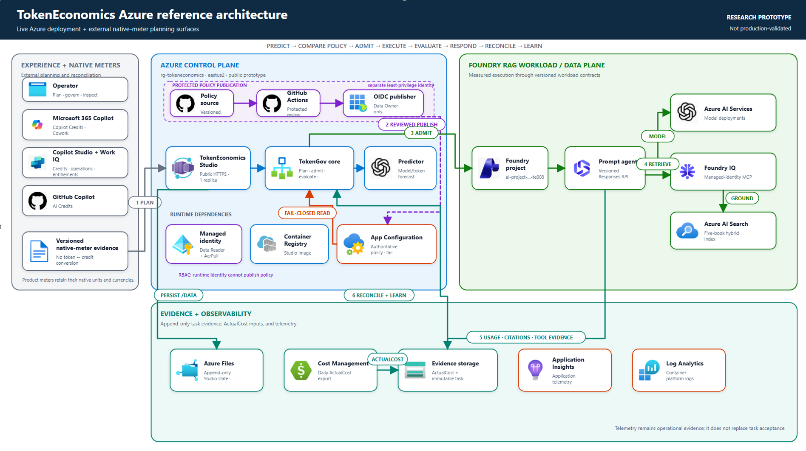

# TokenEconomics

**AI unit economics: predict, govern, learn.**

Per-token model prices keep falling, yet agent bills can still rise because agents execute
long, branching, stochastic trajectories. TokenEconomics plans and governs the unit that
maps to business value: **cost per accepted task**, not cost per token.

```text
predict -> compare policy -> admit -> execute -> evaluate -> respond -> reconcile -> learn
```

The architecture separates two concerns:

- **FutureTokenPredictor** provides feed-forward workload and model-cost forecasts before
  execution.
- **TokenGov** connects immutable forecasts to policy, runtime evidence, quality
  evaluation, bounded response, and reconciliation.

TokenEconomics composes existing Azure and Microsoft primitives rather than replacing
them. Current outputs are research-prototype evidence, not guaranteed savings, quality,
production readiness, or calibrated tail-risk claims.

## Current scope

Studio now presents four operator workspaces:

```text
Home -> Forecast -> Policy -> Execute & Review -> Performance & Decisions
```

The underlying governance lifecycle remains:

```text
predict -> compare policy -> admit -> execute -> evaluate -> respond -> reconcile -> learn
```

**Forecast** models Foundry usage, infrastructure, and commercial meter stacks for
Microsoft Copilot, Copilot Studio, Cowork, Work IQ, and GitHub Copilot. Subscriptions,
entitlements, Microsoft Copilot Credits, GitHub AI Credits, model tokens, and Azure
resource meters remain separate evidence; TokenEconomics does not invent a conversion
between them. New forecasts preserve versioned workload analysis, pricing evidence,
infrastructure assumptions, meter ledgers, and immutable receipt identities.

**Policy** exposes the exact fail-closed Azure App Configuration authority and supports
reviewed policy change requests without giving the browser publication credentials.
**Execute & Review** joins admitted execution, Foundry evaluation, and append-only human
acceptance. **Performance & Decisions** combines governance, accepted-task economics,
reconciliation, and learning while preserving their distinct evidence boundaries.

The repository also contains a policy-bound Microsoft Foundry RAG adapter that captured
one measured reference trajectory through a Foundry prompt agent, Foundry IQ knowledge
base, MCP retrieval, Azure AI Search, cited synthesis, and provider-reported token usage.
Workload-specific Foundry, Search, MCP, and corpus translation remains under `rag/`;
reusable TokenGov contracts remain under `costgov/`.

## Architecture at a glance



The architecture preserves two planes:

| Plane | Responsibility |
|---|---|
| Control plane | Studio, FutureTokenPredictor, TokenGov policy comparison, evaluation, decisions, reconciliation, and learning |
| Workload/data plane | The Foundry prompt agent, model calls, Foundry IQ retrieval, Azure AI Search, and runtime evidence emission |

Azure App Configuration is the authoritative policy source and is read fail-closed.
GitHub Actions publishes reviewed policy through a separately authorized OIDC identity.
The Studio runtime uses managed identity with narrowly scoped App Configuration reader,
ACR pull, and cost-export reader roles. Azure Files stores persistent Studio evidence;
Application Insights, Log Analytics, Cost Management, and evidence stores support
observability and reconciliation.

Microsoft 365 and Copilot product meters enter Forecast as versioned native-meter
evidence. They do not become Azure TokenGov runtime controls, and workload-specific RAG
logic remains under `rag/` rather than in reusable `costgov/` core.

The architecture image is stored under `docs/architecture/`. The editable
[Mermaid source](docs/architecture/token-economics-azure-architecture.mmd) remains
available for future revisions.

## Run Studio locally

Prerequisites: **Python 3.11+**, **git**, and PowerShell.

```powershell
git clone https://github.com/pd-illinois/TokenEconomics.git
cd TokenEconomics
python -m venv .venv
.\.venv\Scripts\python.exe -m pip install --upgrade pip
.\.venv\Scripts\python.exe -m pip install -e ".\FutureTokenPredictor[dev]"
.\.venv\Scripts\python.exe .\studio.py
```

Open <http://127.0.0.1:8765>.

Studio prioritizes this checkout's `FutureTokenPredictor\src` for in-process
forecast validation and learning, matching the CLI and predictor MCP process.
An older globally installed or sibling editable predictor must not supply those
modules. Restart Studio after updating runtime code; refreshing the browser does
not reload Python imports. Missing feedback dependencies return an explicit
HTTP 503 error rather than an empty connection or missing-evidence result.

Studio stores local reports, plans, runs, and reconciliation evidence in ignored
root-level runtime directories. These files survive server restarts but are not committed.

### Local Azure policy authentication

When using multiple Azure tenants, the CLI's default account or another developer
credential can return a token that the policy store rejects with `Unauthorized`.
For local policy reads, set `TOKENGOV_POLICY_AZURE_CLI_SUBSCRIPTION` in `.env` to
the subscription UUID of the already authenticated account that can read the
configured App Configuration store. This selects `AzureCliCredential(subscription=...)`
for policy reads only, without changing the global CLI default or other Azure clients.

For local deployed-agent and Q&A evaluation operations, set
`TOKENGOV_RAG_AZURE_CLI_SUBSCRIPTION` to the intended subscription UUID. This
pins the same already authenticated Azure CLI account for agent inventory,
policy rechecks during a batch, source response calls, evaluation-project
inventory, and evaluation retrieval. It prevents another cached developer
credential from silently winning the default chain. The setting is rejected in
hosted runtimes, which continue to require managed identity.
Restart Studio after changing `.env`; inherited environment variables take precedence.

Leave this setting unset in hosted environments, which retain their default
runtime credential chain. It does not grant RBAC permissions, change the Azure
endpoint/key/label, renew policy, or fall back to a local file. If the selected
account needs an interactive login, authenticate to its tenant using that account.

## Foundry RAG user guide

The Foundry RAG reference workload verifies more than a successful model response. It
binds a versioned Plan receipt to the authoritative Azure App Configuration policy,
executes the pinned Microsoft Foundry prompt agent and Foundry IQ MCP retrieval path,
records provider-reported usage and citations in a complete trajectory envelope, applies
segment-specific acceptance rules, and preserves the resulting meter and governance
evidence. Foundry/RAG-specific translation stays under `rag/`; reusable contracts stay
under `costgov/`.

For a public-safe walkthrough of each Studio responsibility, see the
[TokenEconomics Studio user guide](docs/TOKEN_STUDIO_USER_GUIDE.md).

### What each test proves

| Test | Purpose | Evidence classification |
|---|---|---|
| One-task smoke proof | Confirms policy admission, Foundry agent execution, MCP retrieval, citations, usage capture, immutable persistence, and reopen integrity | Measured live, one complete trajectory |
| 120-task baseline | Evaluates 60 easy and 60 hard tasks with decision-grade segment sample sizes | Measured live cohort |
| Reduced-retrieval windows | Demonstrates two-window quality hysteresis and admission blocking | Measured live regression response |
| Studio review | Reopens existing immutable evidence without making new Foundry calls | Read-only evidence review |

The smoke proof is not decision-grade. The cohort test is the complete evaluation case
and makes billable Foundry calls, so do not rerun it merely to inspect existing evidence.

### Prerequisites

1. Install the local environment from [Run Studio locally](#run-studio-locally).
2. Authenticate to an authorized Azure tenant and subscription:

   ```powershell
   az login --tenant <tenant-id>
   az account set --subscription <subscription-id>
   az account show --query "{name:name,id:id,tenantId:tenantId}" -o table
   ```

3. Confirm that your identity can read the configured App Configuration authority,
   invoke the intended Foundry project and agent, and read the retrieval path.
   Authentication is Entra ID; no API key belongs in `.env`.
4. Confirm the authoritative policy is readable:

   ```powershell
   $env:AZURE_APPCONFIG_ENDPOINT = "https://<app-configuration-name>.azconfig.io"
   $env:TOKENGOV_POLICY_KEY = "<policy-key>"
   $env:TOKENGOV_POLICY_LABEL = "<policy-label>"
   $env:TOKENGOV_POLICY_SOURCE = "azure"
   .\.venv\Scripts\python.exe -c "from costgov.policy_store import load_policy_from_environment; p=load_policy_from_environment(); print(p.document['version'], p.provenance['etag'])"
   ```

Policy versions, content hashes, and ETags are environment-specific evidence. Do not
publish them in public documentation or compare runs as if they used the same authority
unless their immutable provenance matches.

### Verify existing evidence in Studio

The following reference evidence is available in the local development stores:

1. Start Studio and open its URL.
2. Select **Home**, then open the authorized historical report.
3. In **Execute & Review**, confirm the reference run is completed.
4. In **Performance & Decisions**, confirm the easy and hard rows retain separate sample counts,
   acceptance outcomes, native meters, priced cost, and uncovered-cost status.
5. In the Policy/decision evidence, confirm the decision is `none_eligible` and no
   policy mutation was performed.
6. In reconciliation evidence, inspect the ActualCost proof, predictor-learning proof, and
   Work IQ portability proof. ActualCost remains `partial`; the missing AI Services
   billing row must not be inferred as zero.

The same evidence can be checked without the browser:

```powershell
Invoke-RestMethod http://127.0.0.1:8765/health
Invoke-RestMethod http://127.0.0.1:8765/api/runs |
  ConvertTo-Json -Depth 8
Invoke-RestMethod http://127.0.0.1:8765/api/reports/<report-id> |
  ConvertTo-Json -Depth 12
Invoke-RestMethod http://127.0.0.1:8765/api/govern/decisions |
  ConvertTo-Json -Depth 12
```

### Prospective RAG learning and Foundry quality pilot

`rag\evaluation\qna-pilot.v1.json` contains 25 proposed questions, five each for
factual, synthesis, cross-book, ambiguous and unanswerable cases. Expected answers
and rubrics need human review. Corpus byte hashes establish integrity, not the
truth of an answer. Family-aware development/holdout assignments prevent a known
family from appearing on both sides; they are not independent proof against all
semantic leakage. The original ten-question report remains unchanged.

Each learning sample needs its **own new forecast before execution**, with
provider-response input/output means, exact model/agent/retrieval/policy/pricing
configuration and output cap. Generic model-call estimates are not silently
reinterpreted. `PlanStore.complete_response_forecast` preserves the original
baseline beside any explicitly selected calibration candidate. Response learning
uses at least ten eligible independent forecasts for fitting and at least three
later holdouts; adding questions to one batch does not meet those requirements.
Constant predictors or an unusable fit remain explicit failures. WAPE measures
token error, not answer quality, and improvement is not guaranteed.

The default measurement path still records metrics only. An explicitly enabled
trusted response observer can retain bounded answers and exposed retrieval output
**in local memory** for Foundry evaluation. It records provider-response/request
identifiers and content hashes without adding raw answers to Studio journals.
Missing grounding is not reconstructed from expected answers. Foundry evaluation
is a separate content-retention boundary and can incur separate judge charges.

Quality evidence is append-only and linked to the exact saved batch, case,
dataset and captured answer hashes. **Execute & Review** now presents each
Foundry-graded case as a human review candidate. An authorized reviewer must
explicitly record `accepted`, `rejected`, or `inconclusive`; the server resolves
the dataset, response, policy, evaluator, segment, and evidence hashes rather
than accepting those bindings from the browser. A reassessment appends another
outcome and never edits the earlier decision.

**Performance & Decisions** reports accepted-task quality only from the latest
human outcome for each evaluated case. It shows reviewed, accepted, rejected,
and inconclusive counts plus per-segment acceptance. Automated Foundry scores
remain advisory and never become acceptance probability. Missing scores,
unknown citations or abstention evidence, mismatched outputs and judge failures
stay inconclusive. Complete-task cost remains unavailable because retrieval,
evaluation, infrastructure, and other material cost families are not fully
attributed.

Historical reports, forecasts, runs, and evaluation evidence remain immutable when
retired. The current 25-case assessment workspace and repeated campaign identifiers
are environment-specific and intentionally omitted from public documentation.
The campaign is paused after a partial repetition; completed provider calls must not
be replayed. Continuation requires the pending per-question at-most-once and immutable
aggregate-repetition contract.

Foundry run results can retain the service-returned `report_url`, which Studio
renders as **Open in Foundry**. Exact response content is not copied into
immutable Studio evidence; reviewers inspect the Foundry result before deciding.
Local submission still requires explicit `--allow-foundry-content` consent.
Future Container App polling uses the same result contract with managed identity;
a private Foundry project additionally requires Container Apps VNet and private
DNS reachability before hosted polling can work.

Operator entry point (run `--help` or a subcommand's `--help` for required inputs):

```powershell
python scripts\qna_learning.py dataset
python scripts\qna_learning.py forecast --help
python scripts\qna_learning.py run --help
python scripts\qna_learning.py resume --help
python scripts\qna_learning.py fit --help
python scripts\qna_learning.py holdout --help
```

`forecast` completes a saved **fresh draft** using a genuinely new predictor result,
explicit response baseline/source, exact response-configuration JSON and selected
case IDs/partition. Configuration is rechecked against the deployed agent before
inference; the command does not turn operator input into Azure authority.
The baseline file contains `baseline` with `input_tokens_mean` and
`output_tokens_mean`, plus `source` with schema
`response-baseline-source.v1`, a revision and content hash. Optional candidates
are loaded by immutable ID, not pasted coefficients. A reviewed Govern handoff
and valid authority are still necessary before execution.

`run` requires a stable request UUID, the exact prospective cases, and explicit
`--allow-foundry-content` approval of retention and separately budgeted judge
calls. It uses Groundedness v17 and Relevance v12 plus four native `score_model`
rubrics for correctness, completeness, citation and abstention. Thresholds are
4/5, not 80% correctness. Native grader request serialization is supported by the
installed SDK and documented API. The bounded dataset transport supports 25 rows,
but one workload execution must still obey the active policy's question limit.
See [Foundry Azure OpenAI graders](https://learn.microsoft.com/azure/foundry/concepts/evaluation-evaluators/azure-openai-graders)
and [cloud evaluation results](https://learn.microsoft.com/azure/foundry/observability/how-to/cloud-evaluation-results).

The operator readiness gate retries only failed read-only agent inventory access,
at most three checks with one- and two-second waits. Captured answers remain in
memory while those checks run. Policy denials, expired authority, and changed
agent/judge/retrieval bindings stop immediately; inference and evaluation POSTs
are never retried by this gate. Content-free attempt records in
`studio_runs/qna_readiness/` retain blocker codes and probe exception types without
upstream message bodies. If all checks fail before upload, memory-only content
is still cleared on exit: the answer cannot then be reconstructed for evaluation.

Completed usage is recorded independently of billing and judge completion.
Evaluation stage records live under the existing run's `qna_evaluation` folder.
`resume` performs GETs only: it can recover original uploaded rows from Foundry
only when exact content hashes and response identities match. It never reruns
the agent. Redacted/missing source content or ambiguous POSTs without saved job
IDs stay blocked/in-doubt. Do not change the request ID or stage directory to
bypass an ambiguous submission. Raw Q&A/context and judge rationale are not
written to local stage records. HTTP timeout bounds do not cap remote judge spend.

### Interpretation boundaries

- Provider token usage is model-call evidence; the trajectory joins retrieval, tools,
  model activity, evaluation, acceptance, and allocatable resource evidence.
- Modeled P95 is not a calibrated 5% breach guarantee. The measured monetary decision
  uses a one-sided 95% Clopper-Pearson bound.
- A raw quality score is not acceptance probability. Govern uses explicit accepted,
  rejected, or inconclusive outcomes and a one-sided 95% Wilson lower bound.
- Existing results are measured research-prototype evidence, not guaranteed savings,
  guaranteed quality, or production validation.
- The current constitutional gaps remain: no held-out Tier-2 forecast improvement, no
  cheaper candidate has passed every material segment, and the second workload is not
  decision-grade.

## Run Studio in a container

```powershell
docker build -t tokeneconomics-studio:local .
docker volume create tokeneconomics-studio-data
docker run --rm -p 8765:8765 `
  -e AZURE_APPCONFIG_ENDPOINT=https://<app-configuration-name>.azconfig.io `
  -e TOKENGOV_POLICY_KEY=<policy-key> `
  -e TOKENGOV_POLICY_LABEL=<policy-label> `
  -e TOKENGOV_POLICY_SOURCE=azure `
  -v tokeneconomics-studio-data:/data `
  tokeneconomics-studio:local
```

Local Docker cannot automatically reuse `az login` from the host. The health page and
stored evidence remain available, but Azure policy calls require a container-compatible
Entra credential. The Azure Container Apps deployment uses managed identity instead.

## Foundry model release

Studio loads the versioned catalog from
`data/model_catalogs/foundry-model-release.v2.json`. The complete OpenAI and Anthropic
inventory contains 98 offerings across text, embeddings, image, video, audio, and
specialized modalities. The full inventory is visible, while selectors fail closed to 50
coordinator-capable offerings with verified, model-specific input and output pricing.
Catalog presence, coordinator capability, and selector eligibility are distinct.
Historical catalog releases and receipts remain immutable.

## Repository layout

```text
TokenEconomics/
  studio.py                  # local HTTP API and asynchronous run service
  studio.html                # four-workspace operator interface plus Home
  plan_studio.py             # Plan-only release boundary
  costgov/                   # reusable planning, policy, telemetry, and contracts
  data/                      # versioned commercial, model, and schema evidence
  FutureTokenPredictor/      # model/workload forecasting component
  rag/                       # Foundry RAG reference-workload adapter
  infra/                     # Azure policy and reference infrastructure
  scripts/                   # release, regression, and live-proof utilities
  tests/                     # TokenEconomics integration and contract tests
```

The original deterministic five-act simulation remains available:

```powershell
.\.venv\Scripts\python.exe .\demo.py
.\.venv\Scripts\python.exe .\dashboard.py
```

It uses simulated models and illustrative costs; it is mechanism evidence, not a current
provider-price or savings claim.

## Azure policy authority

The policy deployment creates an Azure App Configuration store, disables access-key
authentication, gives Studio a read-only runtime identity, and reserves publication for a
separately authorized identity:

```powershell
az login
pwsh .\infra\provision-policy.ps1 -SubscriptionId <subscription-id>
```

Studio fails closed when the configured Azure policy or required provenance cannot be
read. Browser code never receives policy-publisher credentials.

### Configure policy review privately

Govern can prepare a durable policy change request, but publication must remain in a
separately authorized workflow. Configure repository permissions, identity federation,
secret references, authenticated ingress, reviewer gates, and environment restrictions
outside this public repository. Never place GitHub tokens, private keys, client secrets,
publisher credentials, or App Configuration write permissions in browser code or
committed configuration.

## Validate

Run the Studio-owned suite from the repository root:

```powershell
.\.venv\Scripts\python.exe -m pytest -q
```

Run FutureTokenPredictor through its evidence runner:

```powershell
.\.venv\Scripts\python.exe .\FutureTokenPredictor\scripts\run_tests.py tests --expect pass
```

These suites validate local contracts and modeled calculations. They do not independently
validate live Azure credentials, deployed model behavior, private pricing, accepted-task
quality, or production capacity.
