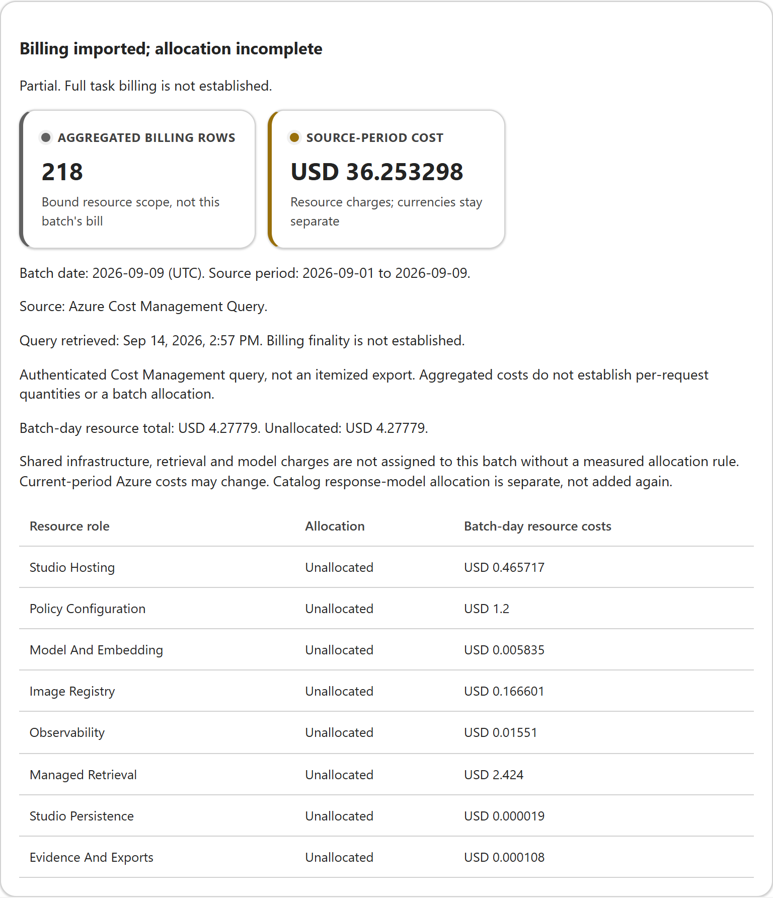

# Token Economics in Practice, Part 2: Taking Token Studio Beyond the Forecast

*A walkthrough of a real RAG workload, from the initial estimate to reviewing what it used.*

> **Draft for review.** This walkthrough reflects the application on September 14, 2026. It uses saved results; no new questions were run for this article. TokenEconomics is a research prototype, not a Microsoft product.

In [Part 1](https://techcommunity.microsoft.com/blog/AzureArchitectureBlog/token-economics-in-practice/4540472), I looked at a question that comes up whenever we build with AI: how much does it cost to get a useful answer?

The price of a token is only part of that answer. An agent might search for information, call a tool, retry a request, or produce something that needs correcting. All of that affects the cost of getting the job done.

At the time, the working UI mainly helped estimate token usage and model cost. The article described a bigger loop: forecast the workload, apply policy, measure what happens, and use the results to improve the next estimate.

Since then, I have been connecting those steps in TokenEconomics Studio. It now runs on Azure, and I can follow a saved forecast through to an actual agent run and review the results in the same report.

For this post, I will use a books RAG example. It is small enough to follow, but it raises several questions that matter just as much in a larger deployment.

## What has changed since Part 1?

The biggest change is that the forecast no longer sits on its own.

Studio now has four connected workspaces: **Forecast**, **Policy**, **Execute & Review**, and **Performance & Decisions**. A report keeps the forecasts, runs, and reviews together. I can change an estimate without losing the earlier version, or open a previous run without sending the questions again.

There is also an infrastructure estimate, a connection to imported Azure billing data, and a place to record usage for future forecast improvements.

Some of this is working end to end; some still needs more data or integration work. I will point out those differences as we go. A finished screen does not necessarily mean the underlying problem is solved.

## Start with the books RAG workload

The report is called **Gutenberg books RAG - live Foundry playground**. Its agent answers questions using information from five Project Gutenberg books. It runs in Microsoft Foundry, uses GPT-4.1 Mini, and retrieves information through a knowledge source backed by Azure AI Search.

The saved forecast assumes ten users, each making three requests a day. Studio walks through the workload description, the proposed profile, and the infrastructure before saving the estimate.

*Figure 1. The saved forecast. Earlier versions are still available in the report.*

For RAG, the retrieved text matters as much as the user's question. This forecast includes assumptions about how much document context reaches the model and how long the answer will be. Those assumptions are visible, so I can come back to them after seeing real usage.

The infrastructure estimate adds another useful perspective. The proposed setup comes to about **$825.40 a month**, with **$735.84 of that coming from Azure AI Search**.

That is a retail-price estimate for the proposed configuration, not the bill for the deployed environment. But it makes an important point: a low model price does not necessarily make the whole application inexpensive.

Each saved forecast keeps its original inputs and calculations. If I revise the assumptions later, Studio creates a new version rather than making the old forecast look more accurate after the fact.

## Check the policy before running anything

The Policy page shows the rules currently stored in **Azure App Configuration**. These include allowed models, spend limits, and quality requirements.

*Figure 2. Policy settings are read from Azure. Editing a proposal in Studio does not change them immediately.*

There is a practical example of why this matters in the current report. The permission used for the September 9 measurement batch has expired. The results are still available to review, but that old permission cannot authorize another run.

A replacement needs to go through review and publication. The protected GitHub publication workflow has been used before, but the hosted Studio's review integration still shows **Setup required**. I am not treating the presence of a button as proof that the approval path is ready.

The application reads policy; a separately authorized publisher changes it. If the required Azure policy is missing or invalid, execution is blocked. Reviewing costs and proposing changes stay outside the live request path.

## What did the ten-question batch use?

The completed batch ran on September 9. All ten questions received a response.

Opening **Review batch economics** brings up the saved measurements. It does not run the agent again.

| Measurement | Recorded result |
|---|---:|
| Responses completed | 10 out of 10 |
| Model input tokens | 9,262 |
| Model output tokens | 1,330 |
| Average recorded response time | 6.62 seconds |
| Model cost calculated from the recorded token rates | $0.0058328 |

That last number is less than one cent for the model usage reported across the batch. It uses the recorded rates of $0.40 per million input tokens and $1.60 per million output tokens.

It is a useful number, but it is not the total cost of answering the questions. Search, embedding, hidden internal calls, and shared infrastructure are not fully covered by it.

There is another unanswered question: were the answers good enough?

The batch records usage and completion, but it does not yet have a connected quality evaluation. Ten responses is therefore not the same as ten correct, useful answers. The current records keep metrics rather than the question and answer text, so I cannot judge quality by reopening this dashboard.

### Use the comparison to find assumptions worth changing

The **Performance & Decisions** page puts the forecast beside the recorded usage.

*Figure 3. The run completed, but quality evaluation and full billing are still missing.*

One difference stands out. The forecast assumed **1,200 output tokens per invocation**. The recorded responses averaged **133 output tokens**.

I would start by reviewing the answer-length assumption. The forecast also exceeds the batch's recorded output limit of 1,024 tokens, which is another reason to revisit it.

What I would not do is turn that difference into a savings percentage. The forecast and the provider's response measurements may cover different work, and shorter answers are not necessarily equally useful.

The comparison table uses arrows to show whether an observed value is above or below the forecast. It also labels comparisons that need caution. Missing values stay marked as unavailable rather than appearing as zero.

Below the charts, findings point back to the relevant work: review an assumption, inspect policy, or prepare a better experiment. A saved review records that assessment. It does not automatically change the model or approve a new policy.

## The model cost and the Azure bill tell different stories

The billing panel is where the distinction becomes clearer.

The first billing export arrived before the batch ran. To get a more useful picture, I queried Azure Cost Management again for the eight resources associated with this workload. The newer data shows roughly **$36.25 for September 1–9**, including **$4.28 for September 9**. These are current-period charges, not a final invoice.

*Figure 4. Newer Azure billing now includes model charges. Assigning the resource bill to this batch is still a separate step. This is the updated local Studio reading real Azure billing data; the hosted deployment has not been updated.*

There is a useful cross-check in that day's bill. The GPT-4.1 Mini input and output meters add up to **$0.0058328**, exactly the amount calculated from the batch's recorded tokens. Azure's model diagnostics also show 9,262 input tokens and 1,330 output tokens for that deployment that day.

That agreement is encouraging, but it is not a complete audit trail. The saved batch did not retain Azure request IDs, so I cannot directly link those billing and diagnostic records back to its individual responses. There is also a small embedding charge that I cannot confidently assign to this batch.

The bigger costs need a different kind of evidence. Azure AI Search accounts for **$2.424** of the day's bill, and App Configuration for **$1.20**. Those services were available beyond these ten questions. Dividing the whole day's bill by ten would charge this batch for everything, without showing what it actually used.

Studio therefore keeps the resource charges **unallocated**. The token-based calculation and the Azure billing total remain separate; adding them would risk counting the model cost twice. The newer snapshot sits alongside the original rather than replacing its history.

This refresh used an authorized local read of Cost Management, not a workaround for the blocked export storage. The hosted application's export connection is still blocked, and its identity has not been given access to this alternative query path.

So the billing picture is better: we now have run-day charges, including the model meters, and an independent usage cross-check. What we still do not have is a defensible total cost per question.

## Can the next forecast learn from this run?

That is the goal, but this batch has not improved a forecast yet.

Studio has recorded one usage observation. It has **zero observations eligible for calibration**, meaning none can currently be used to adjust the predictor.

The reason is straightforward: we need to compare like with like. This saved forecast does not define its prediction in exactly the same terms as the recorded agent responses. Also, ten questions under one forecast do not give us ten independent forecast-and-result pairs.

The learning panel includes help for **WAPE**, or Weighted Absolute Percentage Error. It measures the size of forecast errors relative to actual usage. Lower is better, but it says nothing about answer quality. For this batch, the before-and-after values are unavailable.

To show that learning works, I need enough matching observations to adjust the predictor, then separate observations to check whether the next predictions are actually better. Rewriting the original estimate to fit the results would not demonstrate that.

## What is ready, and what comes next?

The current Studio makes it possible to follow a real workload from a saved estimate to policy inspection, recorded usage, and a cost review. That is the main step forward from Part 1.

Moving it to Azure also exposed some ordinary but important hosting problems. In one incident, the web process was running while its stored reports were unavailable. Studio now checks storage readiness separately from process health. The recovery preserved the existing records, although a longer-term storage dependency still needs attention.

The hosted release currently supports **Microsoft Foundry only**. Other choices, including Copilot Studio and GitHub Copilot, are visible as future-release options. Broader local modeling work accounts for their different billing units, but these are not all working hosted integrations.

For the books workload, the next priorities are to evaluate answer quality, fill in missing costs, and demonstrate that measured usage improves a later forecast. Quality needs to be checked separately for different kinds of questions; a good average must not hide poor results on the harder ones.

Before claiming quality-preserving optimization, I also need to compare alternatives fairly, measure how often task costs exceed the budget, and show that an authorized change can be stopped or reverted if quality drops. A planning range alone cannot establish those protections. The books-specific retrieval and evaluation belong in the workload integration, not in the reusable governance core.

For now, I can open one report and see what I expected, what the agent reported, and which costs and quality checks are still missing. That is a much better starting point for deciding what to change than looking at the model price alone.

---

## Further reading

- [Part 1: Token Economics in Practice](https://techcommunity.microsoft.com/blog/AzureArchitectureBlog/token-economics-in-practice/4540472)
- [Studio user guide](TOKEN_STUDIO_USER_GUIDE.md), with the full screen-by-screen walkthrough.
- [Project principles and completion criteria](09_TOKENECONOMICS_CONSTITUTION.md).
- [Implementation notes](decision.md), particularly D92 for billing and learning, D94 for the hosted release, D95 for storage readiness, and D96 for the billing refresh.
- [Azure App Configuration access with Microsoft Entra ID](https://learn.microsoft.com/en-us/azure/azure-app-configuration/concept-enable-rbac).
- [Create and manage Azure Cost Management exports](https://learn.microsoft.com/en-us/azure/cost-management-billing/costs/tutorial-improved-exports).
- [Azure Cost Management Query API](https://learn.microsoft.com/en-us/rest/api/cost-management/query/usage?view=rest-cost-management-2023-11-01).

### Editor's notes — remove before publication

- **Publication:** Check the four screenshots for information you want to keep private, and replace relative repository links with public URLs. Deployment limitations describe September 14, 2026, not necessarily the publication date.
- **Example:** Report `RPT-20260908-CA037FE9`, forecast `e997e27b-ac11-49c6-bbf9-bdc8eb3c9bd6`, prediction `5176`, and batch `run-f87aa8eae8ef4c57a05a6defb5da9b79`. The user guide contains the detailed references.
- **Figure 4 evidence:** The September 14 query returned 218 aggregated rows, not an itemized export. Local snapshot `billing-83ec674cb97148d76484a6ade416dc8e215785a03dbc59a3c199a07c5470477a` retains its exact request and raw response. D96 records the source hashes and attribution limits. Figures 1-3 and the guide/PDF retain their earlier Azure capture; Figure 4 intentionally shows the newer local build.
- **Part 1 source:** The comparison uses the published article's narrative, retrieved from its public structured data, rather than the differing local draft. Equation and diagram images were not independently transcribed.
- **Possible Part 1 correction:** Its example says halving cost while acceptance falls from 95% to 70% increases cost per accepted task. The stated numbers give `0.5 × 0.95 / 0.70 ≈ 0.679`, a decrease. Consider correcting that example separately; this draft does not repeat it.
