# TokenEconomics Studio user guide

**Connected RAG walkthrough | Azure-hosted edition | September 14, 2026**

This guide follows **Gutenberg books RAG - live Foundry playground**, report
`RPT-20260908-CA037FE9`, through the current Studio. It explains each screen,
the evidence it displays, and why that evidence matters.

**All screenshots are fresh captures of the deployed application on September 14,
2026.** The example uses previously saved forecasts and the completed September 9
batch. No forecasts were generated, questions executed, policies changed, billing
synced, feedback registered, or advisory reviews saved to produce this guide.
Browser navigation and disclosure panels were used with non-read requests blocked.

Open [TokenEconomics Studio on Azure](https://ca-tokeneconomics-studio.wittysand-085ba2f3.eastus2.azurecontainerapps.io/).
The [PDF edition](TOKEN_STUDIO_USER_GUIDE.pdf) contains the same walkthrough.

> **Read the labels before interpreting the numbers.** A forecast is modeled.
> Completed responses are measured usage, not accepted answers. A catalog-priced
> model allocation is not an invoice. An imported resource bill is not automatically
> attributable to a batch. A saved review is advisory, not permission to execute.

## Contents

1. [Home: open the existing report](#1-home-open-the-existing-report)
2. [Shared context and navigation](#2-shared-context-and-navigation)
3. [Forecast: delivery, model and workload profile](#3-forecast-delivery-model-and-workload-profile)
4. [Forecast: read the saved economics](#4-forecast-read-the-saved-economics)
5. [Forecast: infrastructure is a separate estimate](#5-forecast-infrastructure-is-a-separate-estimate)
6. [Policy: authority, limits and expiry](#6-policy-authority-limits-and-expiry)
7. [Policy: change requests and publication](#7-policy-change-requests-and-publication)
8. [Execute & Review: understand the playground](#8-execute--review-understand-the-playground)
9. [Execute & Review: open the completed batch](#9-execute--review-open-the-completed-batch)
10. [Performance & Decisions: read the dashboard](#10-performance--decisions-read-the-dashboard)
11. [Detailed expected-versus-observed comparison](#11-detailed-expected-versus-observed-comparison)
12. [Billing reconciliation](#12-billing-reconciliation)
13. [Response feedback, learning and WAPE](#13-response-feedback-learning-and-wape)
14. [Findings, policy rationale and saved reviews](#14-findings-policy-rationale-and-saved-reviews)
15. [Project history and optional Work IQ evidence](#15-project-history-and-optional-work-iq-evidence)
16. [Safe walkthrough and current limitations](#16-safe-walkthrough-and-current-limitations)
17. [Evidence references and terminology](#17-evidence-references-and-terminology)

## 1. Home: open the existing report

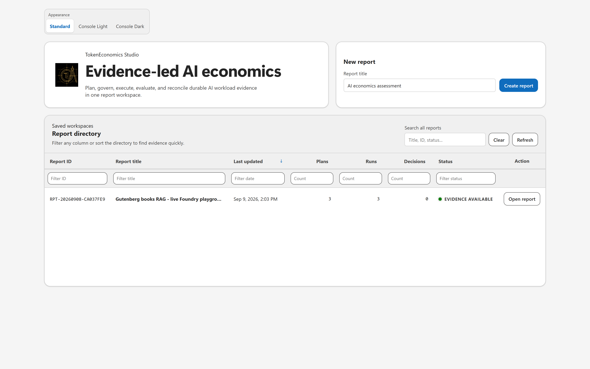

*Figure 1. The current report directory, with the connected RAG report and its
three saved forecasts and three runs.*

Select **Open report** on `RPT-20260908-CA037FE9`. Opening a report restores its
latest saved forecast; it does not repeat estimation or call an AI model.

| Feature | What it shows or does | Why it matters |
|---|---|---|
| Report directory | Report identity, title, last update, artifact counts and status. | Keeps one investigation together rather than comparing unrelated runs. |
| Search, column filters and sortable headings | Find or order saved workspaces; Clear removes filters. | Useful as the directory grows. None creates new evidence. |
| Plans / Runs / Decisions | Counts in the directory's corresponding record categories. | These are inventory counts, not acceptance scores. The Decisions column is not a total of every advisory or billing-feedback record. |
| Evidence available | The report has saved evidence to inspect. | Does not mean quality was accepted, billing is complete, or execution is currently authorized. |
| New report / Create report | Creates another durable workspace. | A state-changing action; not used in this walkthrough. |
| Standard / Console Light / Console Dark | Browser appearance choices. | Changes presentation, not receipts, prices or policy. |

Home intentionally does **not** show Project history. Cross-report experiments
are at the bottom of **Performance & Decisions**.

## 2. Shared context and navigation

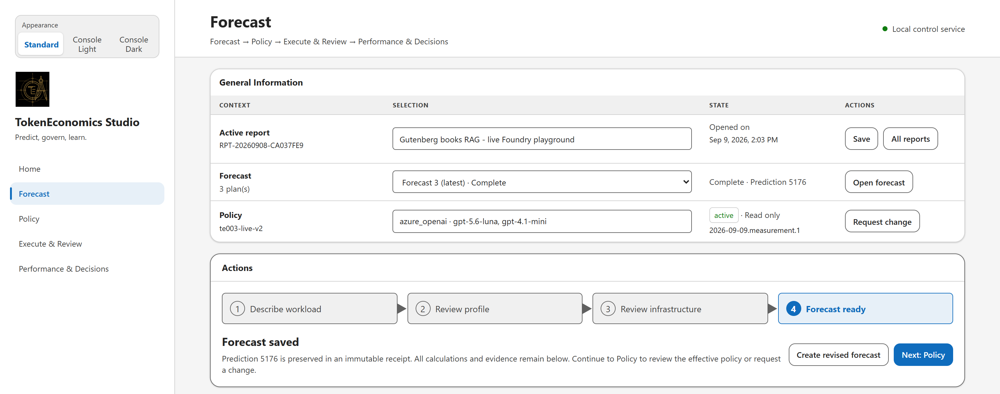

*Figure 2. Opening the report selects Forecast 3 and preserves prediction 5176.*

The sidebar follows **Forecast -> Policy -> Execute & Review -> Performance &
Decisions**. Home is outside that workflow. Selecting a tab navigates; it does not
authorize or start the associated business operation.

Every workflow page begins with **General Information**, followed by **Actions**:

| Area | How to read it |
|---|---|
| Active report | The report ID is stable; the title is descriptive. Save changes report metadata and is not needed for inspection. |
| Associated forecasts | Three revisions are available. Use **Forecast 3 (latest)**, prediction **5176**, for this example. Open forecast restores a selected revision; it does not overwrite another. |
| Policy | Shows the current Azure policy label, allowed supply and version. Read the measurement expiry on the Policy page separately. |
| Actions | Groups the current page's navigation and explicit operations. A visible action does not imply all prerequisites are satisfied. |
| Local control service | Legacy connection wording. In these screenshots, the connected Studio service runs in Azure Container Apps, not on the reader's computer. |

The four connected Forecast stages are **Describe workload**, **Review profile**,
**Review infrastructure**, and **Forecast ready**. The last stage is selected
because this forecast is already saved. **Forecast saved** means its immutable
receipt exists, not that quality or execution has been approved.

Saved forecast inputs remain read-only. **Create revised forecast** begins a new
revision workflow; it was not selected here. Earlier forecasts and their original
model choices remain historical evidence.

Dates in these screenshots use **US Eastern time**. Report dates, batch start
dates, source delivery dates and authorization expiry are different timestamps;
the stored UTC evidence remains authoritative.

## 3. Forecast: delivery, model and workload profile

Scroll below Actions to inspect the saved description and delivery choice.
The description identifies a deployed Foundry agent answering questions about
five Project Gutenberg books using an Azure AI Search-backed knowledge source.

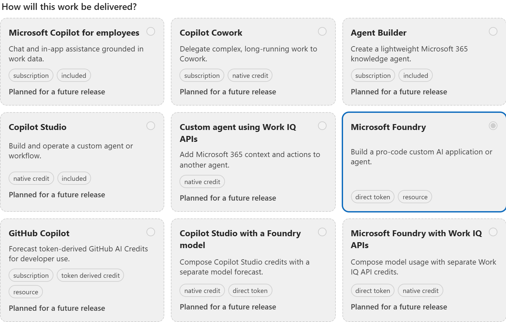

*Figure 3. The hosted release exposes Microsoft Foundry; the other eight options
remain visible with future-release help.*

**Microsoft Foundry is the only available delivery choice in the hosted release.**
The saved form itself is read-only. The eight future routes are Microsoft Copilot
for employees, Copilot Cowork, Agent Builder, Copilot Studio, custom agents using
Work IQ APIs, GitHub Copilot, Copilot Studio with a Foundry model, and Microsoft
Foundry with Work IQ APIs.

Their visibility is not a claim of eight working hosted integrations. Native local
Studio retains broader modeled route support; this guide documents Azure-hosted
behavior. Microsoft Copilot Credits, GitHub AI Credits, subscriptions, direct
model tokens and resource units are distinct meters, not interchangeable balances.

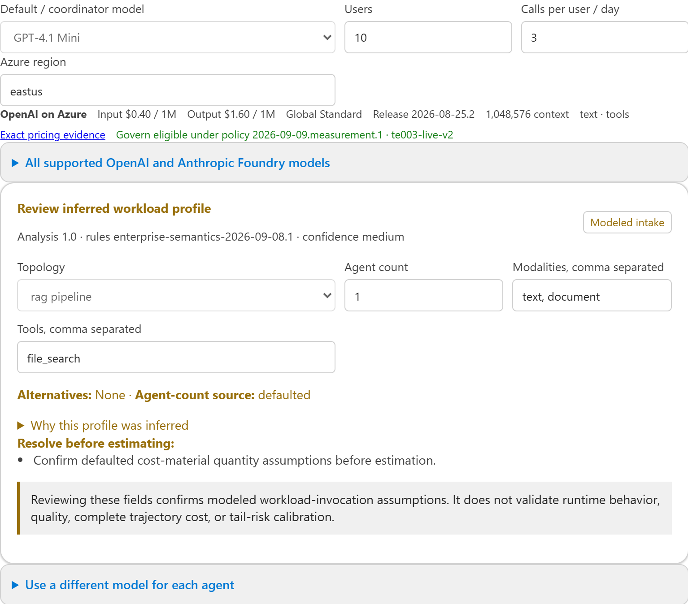

*Figure 4. Saved model and workload assumptions, shown without editing them.*

| Field or panel | Value in this forecast | Meaning and importance |
|---|---|---|
| Default / coordinator model | GPT-4.1 Mini | The model offering used to price this forecast; not merely the cheapest current catalog entry. |
| Users / calls per user per day | 10 / 3 | Forecast scale assumptions, not measured traffic. |
| Azure region | eastus | Planning/pricing region. It is not a live resource inventory; the Studio host itself is in eastus2. |
| Model detail strip | Input $0.40 and output $1.60 per million tokens; Global Standard | Exact catalog pricing and offering context. A catalog release date is different from the deployed model version. |
| Topology | rag pipeline | Selects the applicable workload experience from the saved forecast. |
| Agent count / modalities | 1 / text, document | Modeled structure and token categories, not proof of internal agent steps. |
| Tools | file_search | A forecast assumption. Generic file-search pricing is not automatically valid for the deployed managed knowledge-base tool. |
| Why this profile was inferred | Versioned analysis and rules | Makes defaults and inference explainable instead of silently treating prose as fact. |
| Optional per-agent models | Not used for this one-agent example | Allows modeled allocations in suitable multi-agent forecasts; turn weights are not measured runtime turns. |

**Why this screen matters:** forecasts are only meaningful with their assumptions.
Checking topology, retrieval context, scale and tool applicability is more useful
than reading an isolated dollar figure.

## 4. Forecast: read the saved economics

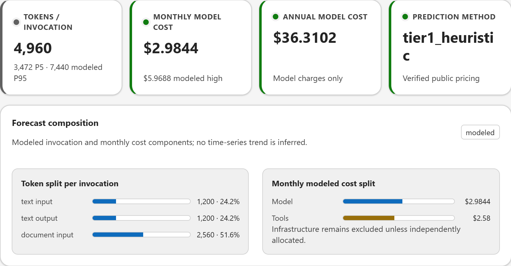

*Figure 5. The forecast separates token demand, model costs and generic tool costs.*

| Saved result | Value | Interpretation |
|---|---:|---|
| Tokens per invocation | 4,960 | Modeled total, not an observed complete agent trajectory. |
| Text input / document input / text output | 1,200 / 2,560 / 1,200 | The document context assumption contributes to modeled model input. |
| P5 / P50 / P95 tokens | 3,472 / 4,960 / 7,440 | Heuristic distribution points, not calibrated budget-breach guarantees. |
| Monthly model mean | USD 2.9844 | Model-only estimate under the saved scale and cache assumptions. |
| Annual model mean | USD 36.3102 | Uses 365 days, whereas monthly uses 30 days; do not assume annual equals monthly times 12. |
| Generic tool estimate | USD 2.58/month | Separate from model costs and subject to tool-scope applicability. |
| Prediction method | tier1_heuristic | This saved prediction is not a calibrated response-usage forecast. |

The composition charts show the token mix and separate monthly modeled components.
They are not historical time-series charts. Infrastructure is excluded from those
model/tool bars and has its own section.

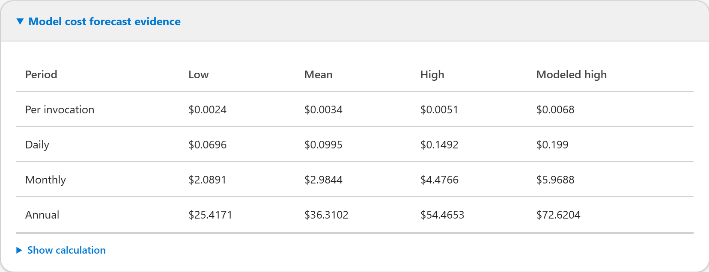

*Figure 6. Low, mean, high and modeled-high values retain their modeled status.*

Expand the evidence panels to understand the result:

| Panel | What to inspect |
|---|---|
| Token estimate and calculation evidence | Modality quantities, distribution points and the calculation explanation. |
| Model cost forecast evidence | Per-invocation, daily, monthly and annual ranges; **Show calculation** reveals the underlying assumptions. |
| Confirmed workload analysis | Analyzer/rule version, inferred versus confirmed topology, modalities and tools. |
| Non-model tool-charge evidence | Separately estimated generic tool charges; do not silently add them to measured managed-retrieval costs. |
| Workload, assumptions, and provenance | Prediction and receipt identity, model/catalog/pricing sources, workload and segment contracts, and method. |

The stored per-call model mean is **USD 0.003424**; the period table rounds it for
display. Its assumptions include five retrieved chunks of 512 tokens, a 60%
system-prompt share and a 75% cache hit rate after the first call per user. These
are not measurements from the ten-question batch.

**Why this screen matters:** it makes the forecast reproducible. Revising a
misleading assumption should create new forecast evidence, not alter the old
receipt to match a later observation.

## 5. Forecast: infrastructure is a separate estimate

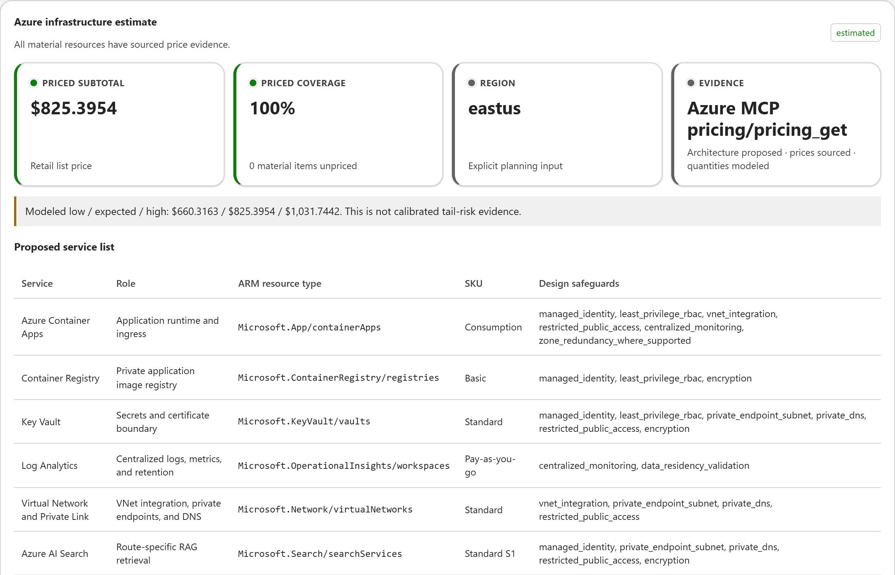

*Figure 7. Proposed service roles, design safeguards and coverage of the defined
baseline. This is not discovery of deployed resources.*

The saved **Azure infrastructure estimate** shows **USD 825.3954/month**, **100%
priced coverage**, region **eastus**, and no unpriced material items within this
defined baseline. Its low/expected/high scenario is approximately USD
660.3163 / 825.3954 / 1,031.7442.

The six service families are Container Apps, Container Registry, Key Vault, Log
Analytics, networking/Private Link, and Azure AI Search. Read the role, ARM resource
type, SKU and design safeguards to understand what was proposed.

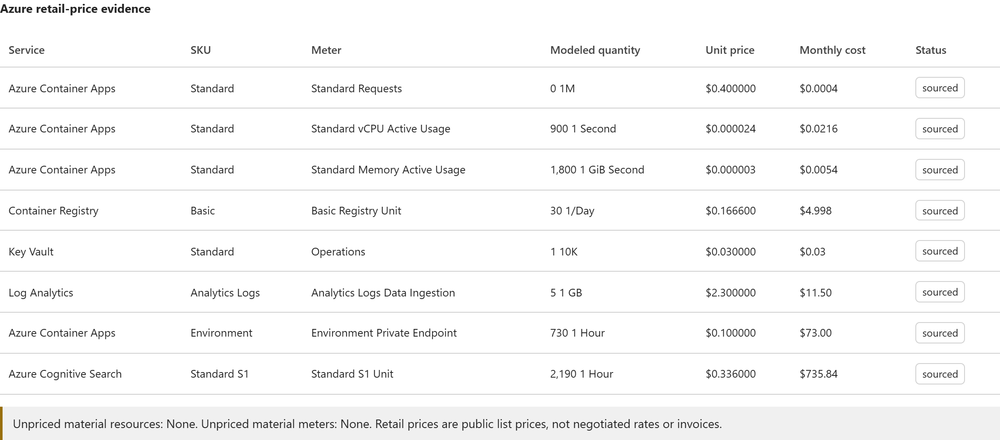

*Figure 8. Retail meters and quantities explain the subtotal instead of hiding
infrastructure behind the model price.*

Azure AI Search contributes **USD 735.84/month**: Standard S1 at USD 0.336 per
search-unit hour, with three modeled replicas, one partition and 730 hours.
The private-endpoint line contributes USD 73/month. The other priced lines cover
the defined compute, memory, requests, registry, secrets and logging assumptions.

**100% coverage is coverage of the proposed baseline, not every possible charge.**
It does not prove that all safeguards were deployed, that shared resources belong
to this batch, or that managed retrieval and embedding charges are fully known.
Retail list prices are not negotiated prices or invoices.

**Why this screen matters:** a very small model-call allocation can coexist with
material shared infrastructure costs. Neither should hide the other, and a monthly
capacity estimate must not be divided among ten questions without a defensible
allocation rule.

## 6. Policy: authority, limits and expiry

Select **Policy**, then **Effective policy**. This page reads the configured Azure
authority rather than turning the forecast's assumptions into permission.

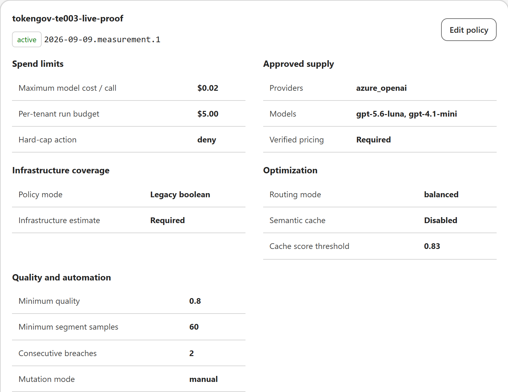

*Figure 9. The current policy is read-only. Model spend, quality settings and
infrastructure requirements are separate controls.*

| Current control | Displayed value | How to interpret it |
|---|---|---|
| Policy version | 2026-09-09.measurement.1 | The version read during this walkthrough. |
| Maximum model cost per call | USD 0.02 | A model admission ceiling, not a complete-trajectory cost guarantee. |
| Per-tenant run budget / hard-cap action | USD 5 / deny | General policy controls; do not confuse them with bounded measurement authorization. |
| Approved supply | azure_openai; gpt-5.6-luna and gpt-4.1-mini | Policy allowlisting does not mean either deployment is currently runnable. |
| Verified pricing | Required | Unsupported price assumptions cannot silently pass as verified. |
| Infrastructure requirement | Required; Legacy boolean mode | This particular policy has the legacy requirement, not the richer region/coverage controls available in newer policy contracts. |
| Routing / semantic cache | balanced / Disabled | Recorded controls, not proof that routing or caching optimized this batch. |
| Quality / segment samples | 0.8 / 60 | Requirements, not observed quality or samples supplied by this report. |
| Consecutive breaches / mutation mode | 2 / manual | Response posture; no automatic optimization is implied. |

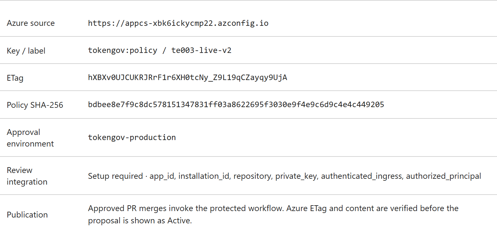

*Figure 10. Azure source, key/label, ETag and hash identify the authority. Hosted
review integration currently reports setup required.*

The ETag and content hash matter when reviewing or publishing a replacement:
a proposal must not overwrite a policy that changed underneath it. Runtime
readers and authorized policy publishers have separate responsibilities.

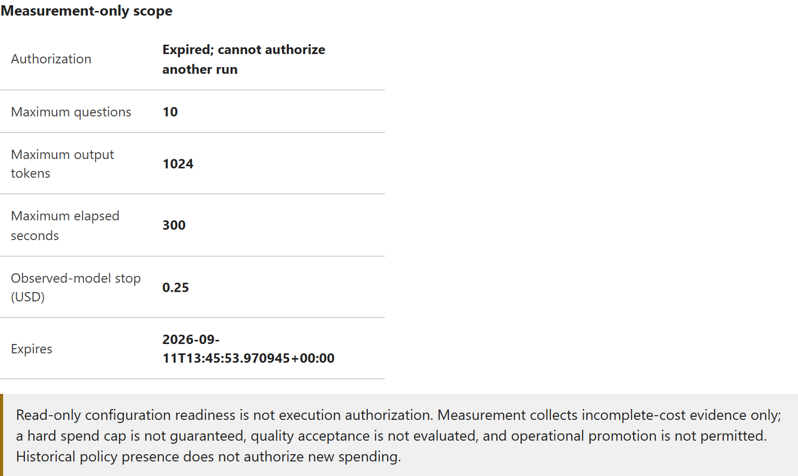

*Figure 11. The policy document is active, but its measurement grant is expired.*

**As of the screenshot date, another measurement run is not authorized.** The
grant expired on **September 11, 2026 at 13:45:53 UTC**. Its recorded bounds were
10 questions, 1,024 output tokens per response, 300 elapsed seconds and a USD
0.25 observed-model stop.

An observed-model stop can stop subsequent questions; it is **not a guaranteed
all-in spend ceiling**, especially where hidden managed-service charges are
unavailable. This measurement scope does not evaluate quality or permit operational
promotion. Historical success is not permanent permission for future spending.

## 7. Policy: change requests and publication

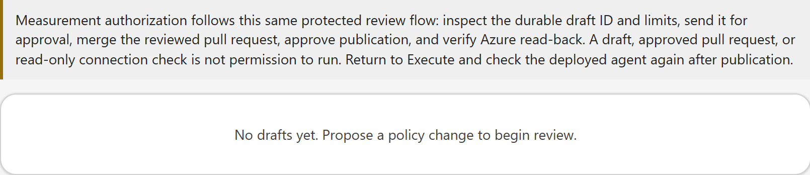

*Figure 12. Change requests is an inspection surface here; no draft was created
for the walkthrough.*

The hosted list currently says **No drafts yet**. This is not evidence that the
active policy was never published; the current authority and historical
publication evidence are distinct from this hosted draft inventory.

**Create policy**, **Edit active policy**, **Edit policy** and **Request change**
start proposal authoring. A saved draft is a durable proposed revision with a
business reason, not an immediate change to Azure.

The intended protected sequence is draft, review request, reviewed pull request,
approved publication and Azure read-back verification. **The hosted review
integration currently reports setup required**, including its GitHub App and
authenticated/authorized caller configuration. Do not interpret the explanatory
publication text as proof those hosted controls are operational today.

**Why this screen matters:** it separates requesting a change from authorizing
one. This guide neither creates a replacement grant nor suggests bypassing the
expired grant. Operator setup and a separately reviewed publication would be
needed before a future authorized measurement.

## 8. Execute & Review: understand the playground

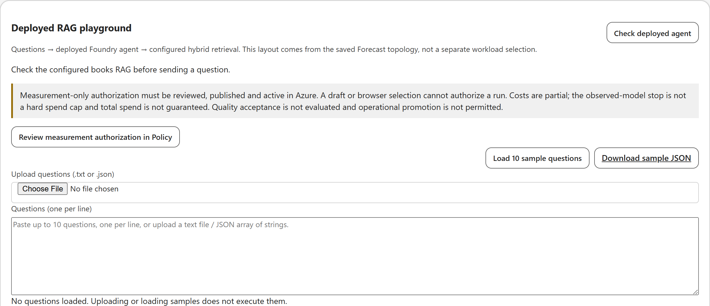

*Figure 13. The deployed RAG playground is selected by the saved forecast.
The question input is deliberately left empty.*

The topology badge is **rag_pipeline**. The configured path uses the deployed
Foundry agent wrapper and its knowledge retrieval, not the older direct lexical
Search-plus-model adapter retained in historical evidence.

| Feature | Purpose | Boundary in this walkthrough |
|---|---|---|
| Check deployed agent | Reads configured agent/model/retrieval readiness. | Not clicked. A connection check cannot grant permission to run. |
| Review measurement authorization in Policy | Navigates to policy review. | Navigation, not renewal or publication. |
| Load 10 sample questions / download sample JSON | Helps prepare a future bounded input set. | No samples loaded; downloading or loading is not execution. |
| Upload questions / Questions | Accepts a text file, JSON array or one question per line. | No questions uploaded, entered or submitted. |
| Run measurement-only batch | Explicit billable operation, independently authorized by current Azure policy. | Not clicked; the current grant is expired. |
| Prepare a new batch | Resets preparation after a known outcome; does not itself run. | Not needed to inspect saved runs. |
| Next: Performance & Decisions | Opens the existing evidence review. | Does not evaluate quality or start optimization. |

The implemented measurement input allows 1-10 questions, at most 1,200 characters
per question and files up to 64 KiB. Questions run sequentially when separately
authorized. Unknown submission outcomes remain locked against an accidental new
attempt; saved runs should be inspected before any retry.

**Why this screen matters:** it makes the boundary between preparing, executing
and inspecting explicit. The capability to display a playground is not evidence
that all execution prerequisites are currently satisfied.

## 9. Execute & Review: open the completed batch

Scroll to **Runs in this report** and choose **Review batch economics** for
**Run 3**, September 9, 2026 at 11:06 AM Eastern.

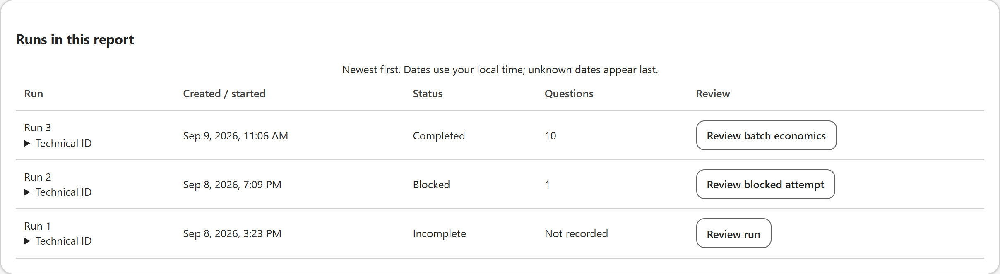

*Figure 14. Run 3 is the completed ten-question example. The earlier blocked and
incomplete attempts remain visible, not silently converted to successes.*

The run table is newest first and exposes long technical IDs only on expansion.
Different attempts are not pooled. An earlier report run can belong to a different
forecast; the Performance batch selector contains only supported matches for the
selected forecast.

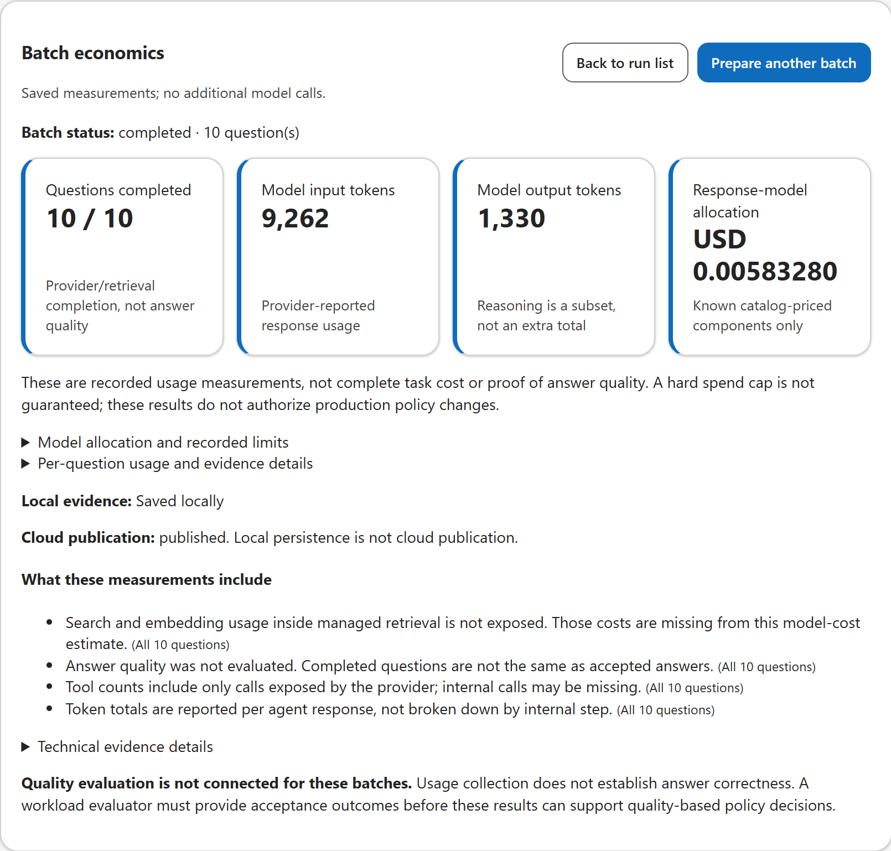

*Figure 15. Opening the saved result reads measured usage without another model
call.*

| Recorded measurement | Value | What it establishes |
|---|---:|---|
| Completed questions | 10 / 10 | Provider/retrieval completion, not ten accepted answers. |
| Model input tokens | 9,262 | Provider-reported response-level usage. |
| Model output tokens | 1,330 | Output usage at the same reported scope. |
| Response-model allocation | USD 0.00583280 | Known catalog-priced model components, not full task cost. |
| Local evidence / cloud publication | Saved locally / published | Separate persistence and publication outcomes. In Azure, local means the service's persisted store, not the reader's laptop. |

The recorded agent is **tokengov-books-rag-agent, version 4**, using **gpt-4.1-mini**
model version **2025-04-14**. Its retrieval configuration is recorded, but
configuration verification alone does not prove the exact retrieval internals of
every question.

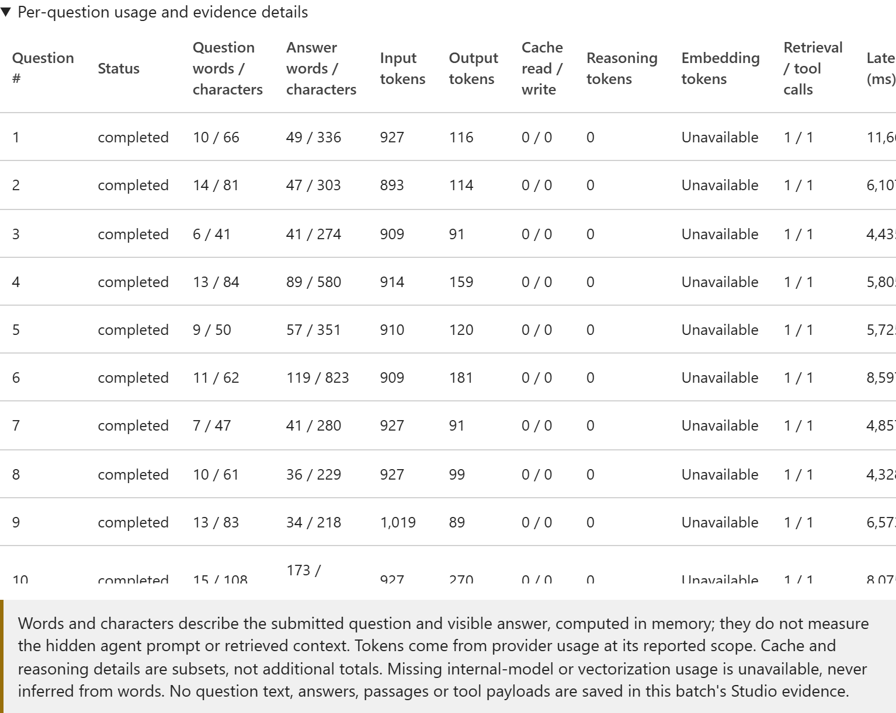

*Figure 16. Per-question metrics expose variation without reconstructing retained
question or answer content. Wide tables can be scrolled horizontally in Studio.*

Expand **Per-question usage and evidence details** to inspect completion, word and
character counts, input/output tokens, cache and reasoning subsets, available
retrieval/tool counts and latency. For example, question 1 records 927 input
tokens, 116 output tokens and 11,660 ms latency.

Word/character counts describe the submitted question and visible answer, computed
in memory. They do not measure hidden agent prompts or retrieved context.
Provider tokens are not inferred from word counts. Cache-read/write and reasoning
details are subsets, not extra quantities to add to input/output totals.

**Embedding usage is unavailable, not zero.** Internal tool calls may be missing.
The current metrics-only record does not retain question text, answers, retrieved
passages or tool payload bodies. Provider-side retention and older historical
records are separate boundaries.

The page states **Quality evaluation is not connected for these batches**.
Compatible acceptance-evidence workflows exist for supported evidence, but
metrics-only batches cannot acquire acceptance merely by opening a review.

## 10. Performance & Decisions: read the dashboard

Select **Performance & Decisions**. Its Actions block selects a saved batch for
the exact forecast. Keep the completed September 9 ten-question batch selected.
**Refresh evidence** rereads saved measurements and current policy;
**Save advisory review** would create a new record and was not used.

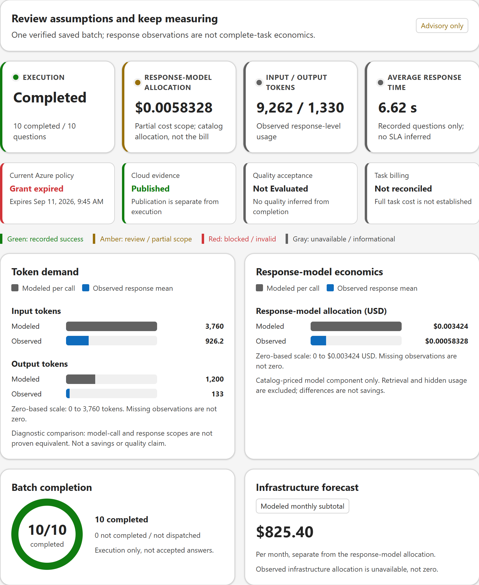

*Figure 17. Recorded completion, current authorization, quality and task billing
can legitimately have different statuses.*

The headline is **Review assumptions and keep measuring**, with **Advisory only**.
Read the four independent status dimensions:

| Status | Current display | Meaning |
|---|---|---|
| Execution | Completed | The selected historical batch returned ten responses. |
| Current Azure policy | Grant expired | New measurement is blocked despite historical completion. |
| Cloud evidence | Published | Evidence publication succeeded separately from execution. |
| Quality acceptance / task billing | Not Evaluated / Not reconciled | Neither useful-output acceptance nor full-task billing is established. |

The dashboard also displays **6.62 seconds average response time**. This is the
mean of recorded per-question latencies, not the elapsed batch duration or a service
SLA.

The **Token demand** chart compares modeled per-call input/output with observed
response means. **Response-model economics** has its own dollar scale.
Both start at zero; missing observations do not get zero-height bars.
**Batch completion** is a 10/10 execution ring, not a quality score.
**Infrastructure forecast** is the separate USD 825.40 modeled monthly subtotal.

Colors are accompanied by labels: green for recorded success, amber for review or
partial scope, red for blocked/invalid evidence, and gray for unavailable or
informational evidence. A green execution card does not clear an amber or red
control elsewhere.

## 11. Detailed expected-versus-observed comparison

Expand **Detailed expected-versus-observed comparison**, immediately below the
completion/infrastructure row and before billing.

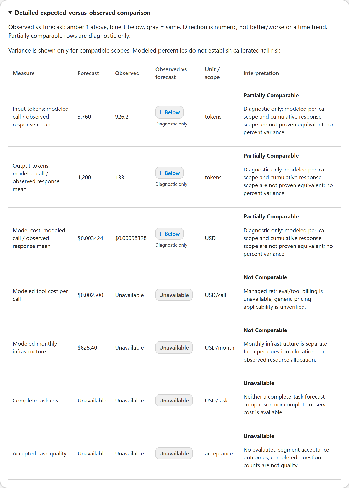

*Figure 18. Direction is visible, while the scope column prevents a misleading
savings or accuracy claim.*

| Comparable-looking component | Forecast | Observed response mean | Reading |
|---|---:|---:|---|
| Input tokens | 3,760 | 926.2 | Below; diagnostic only. |
| Output tokens | 1,200 | 133 | Below; diagnostic only. |
| Response-model allocation | USD 0.003424 | USD 0.00058328 | Below; diagnostic only. |

The blue down-arrow means the observed number is below the forecast number.
An amber up-arrow means above, and gray equals means the same. These are numeric
directions using unrounded values, **not time trends or better/worse judgments**.
The actual screenshot shows the below cases; it is not fabricated to demonstrate
all three directions.

The table labels these pairs **Partially Comparable** and withholds percentage
variance because modeled call scope and provider-response scope are not proven
equivalent. The observed means divide the saved totals by ten completed responses;
they do not represent complete agent-trajectory costs.

Tool and infrastructure observations are unavailable. Complete task cost and
accepted-task quality are unavailable on both sides. None should become zero or
be omitted to make a total appear complete.

**Why this screen matters:** it reveals assumptions worth reviewing without
claiming that a smaller answer preserved quality. In this example, the 1,200-token
forecast output assumption also exceeds the recorded 1,024-token response cap;
that deserves review, not a savings headline.

## 12. Billing reconciliation

Expand **Billing reconciliation and forecast learning**, immediately after the
detailed comparison. This section is bound to the selected forecast and batch,
not all historical experiments.

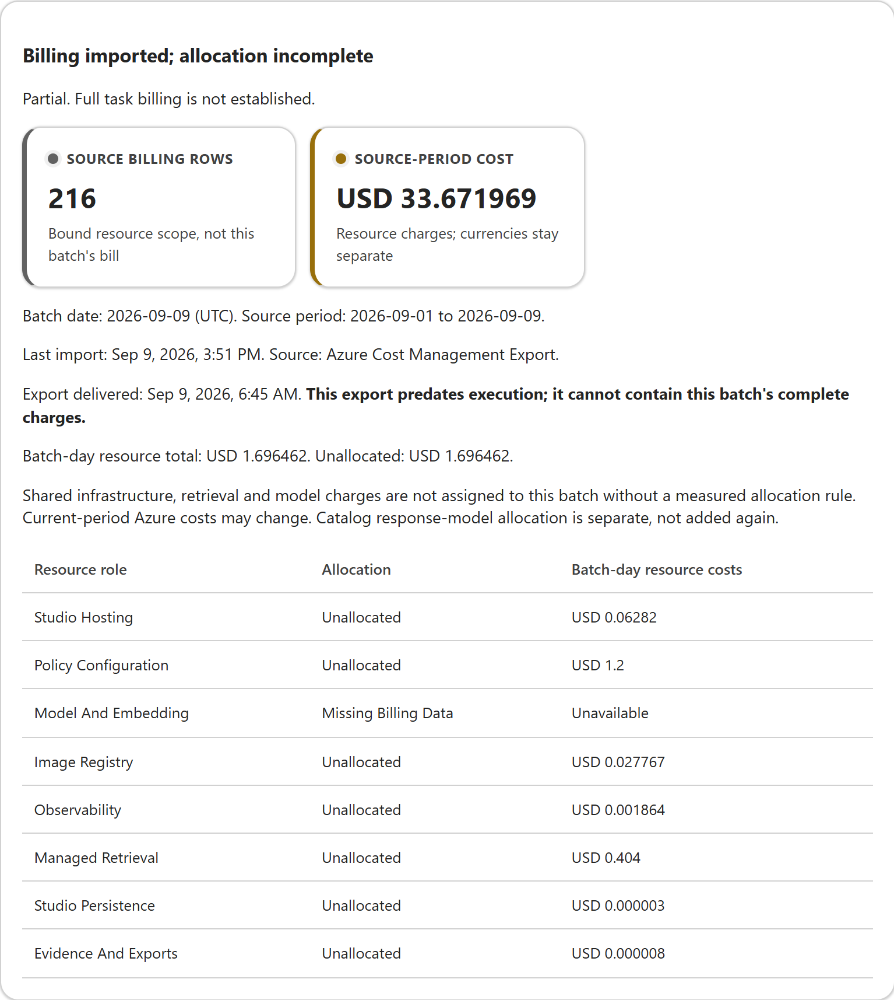

*Figure 19. Actual imported resource charges are visible, but no allocation to the
ten-question batch is invented.*

| Billing evidence | Recorded value | Meaning |
|---|---:|---|
| Bound source rows | 216 | Rows for configured resource scope; 887 other rows were excluded from the 1,103-row source export. |
| Source period | September 1-9, 2026 | Period represented by the imported snapshot, not the batch duration. |
| Source-period charges | USD 33.671969 | Rounded display of USD 33.67196892192 for bound resources. |
| September 9 resource charges | USD 1.696462 | Rounded display of USD 1.69646161512 for that resource day. |
| Unallocated September 9 charges | USD 1.696462 | The entire known resource-day amount remains unallocated to this batch. |
| Model and embedding resource | Missing Billing Data | Required billing evidence is missing; this is not a zero-cost line. |

The export was delivered at **10:45:38 UTC on September 9**, before the batch
started at **15:06 UTC**. It cannot establish this batch's complete charges.
Neither USD 33.67 nor USD 1.70 is the cost of the ten questions. The USD 0.0058328
catalog model allocation is a separate view and must not be added to potentially
overlapping billing rows.

**Cost Management is integrated, but current hosted source access is not fully
operational.** A real snapshot has been imported and remains readable. As recorded
in the deployment decisions, hosted resync is blocked by the billing source's
network restrictions; having Blob Data Reader alone does not bypass networking.
This guide did not attempt a new sync.

| Explicit action | Intended effect | Does opening the panel do this? |
|---|---|---|
| Record usage feedback | Registers verified response usage and saves partial feedback using already imported billing. | No. |
| Sync billing & reconcile | Reads the configured Azure export, imports a source revision and records partial reconciliation/feedback. Requires source access and authorization. | No. |

Both actions write evidence even though neither runs questions. Replaying unchanged
input is deduplicated, not counted as new training evidence. Shared resource
allocation remains server-controlled and requires a measured allocation rule.

## 13. Response feedback, learning and WAPE

The lower card in the same billing/learning panel explains whether saved response
measurements are eligible to improve future predictions.

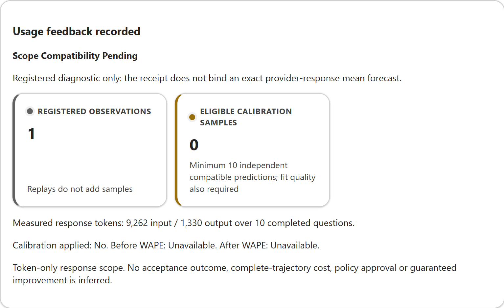

*Figure 20. Recorded observations and eligible learning samples are deliberately
different counts.*

The current card shows **Usage feedback recorded**, **Scope Compatibility Pending**,
**1 registered observation**, **0 eligible calibration samples**, and
**Calibration applied: No**. Before and after WAPE are **Unavailable**.

The original forecast does not bind an exact provider-response mean prediction
contract. Recording response usage cannot retrospectively change its scope.
Ten questions under this one prediction are not ten independent matched
forecast observations.

A future response-calibration path needs a compatible forecast-time
`response-prediction-contract.v1`, independent observations, at least ten eligible
predictions and sufficient fit quality. A separate held-out evaluation is needed
to demonstrate improvement. These requirements are not satisfied by this batch,
and response calibration would still not establish complete-task quality or cost.

### What WAPE means

Select the **i** beside **Forecast error (WAPE)** to open the help note.

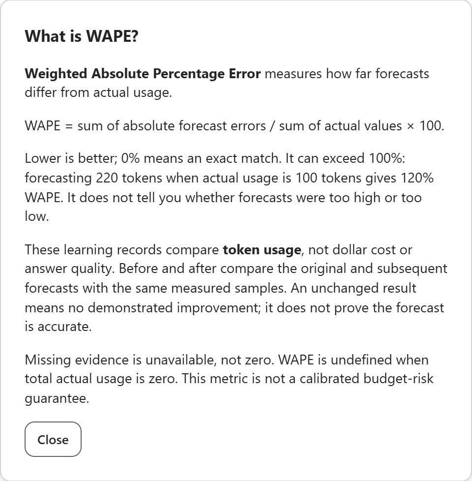

*Figure 21. WAPE help is accessible without running or registering anything.*

**WAPE = sum of absolute forecast errors / sum of actual values x 100.**

For example, forecasts of 120 and 220 tokens versus actuals of 100 and 200 tokens
give `(20 + 20) / (100 + 200) x 100 = 13.33%`. The denominator gives larger actual
volumes more weight; this is not the simple average of the individual percentage
errors.

Lower is better; 0% is an exact match on the compared samples. Forecasting 220
tokens against 100 actual tokens gives **120% WAPE**, which is valid. WAPE does
not show whether errors were too high or too low. It is undefined when total
actual usage is zero.

Here WAPE is **token error**, not billing accuracy, answer quality, completion
percentage or calibrated budget risk. **Unavailable** is not 0%. Equal before and
after values mean no demonstrated improvement, not proof of accuracy.
Close the help with **Close**, Escape or an outside click.

## 14. Findings, policy rationale and saved reviews

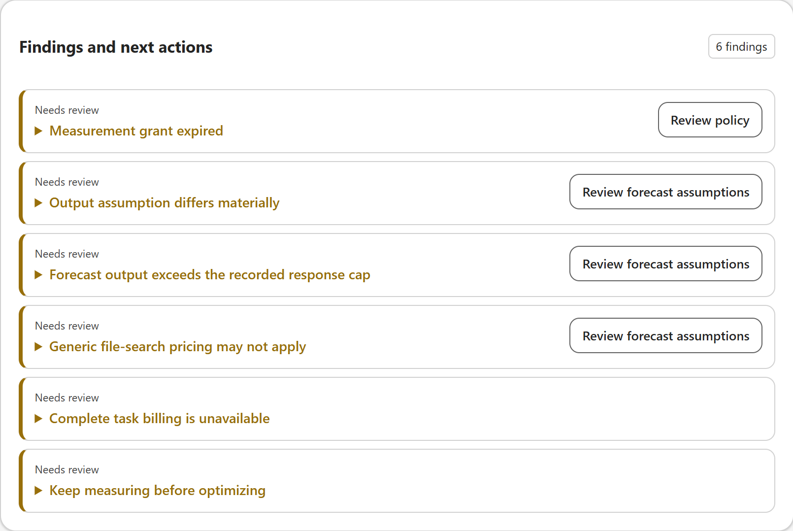

*Figure 22. Findings identify what deserves attention without providing misleading
one-click fixes for missing integrations.*

The live review has six findings:

| Finding | Meaning and appropriate next work |
|---|---|
| Measurement grant expired | Review Policy before a future authorized measurement. A historical run is not invalidated by today's expiry. |
| Output assumption differs materially | Review forecast assumptions against response observations, while retaining the scope caveat. |
| Forecast output exceeds the recorded response cap | Align future assumptions and authorization bounds through reviewed revisions. |
| Generic file-search pricing may not apply | Establish the managed knowledge-base retrieval meter rather than reusing an unrelated tool rate. |
| Complete task billing is unavailable | Obtain missing cost coverage and allocation evidence; there is no fabricated total or placeholder fix button. |
| Keep measuring before optimizing | Provide representative segment-level quality/acceptance evidence before making quality-preserving optimization claims. |

Expand a finding to read its explanation. Existing **Review policy** and
**Review forecast assumptions** links lead to the relevant surface; they were not
used to change anything for this guide. Missing integrations remain explicit gaps.

**Policy binding and advisory decision rationale** reports the execution and current
versions as the same: `2026-09-09.measurement.1`. That equality does not prevent a
time-bound grant from expiring. Version equality and current validity are different
checks.

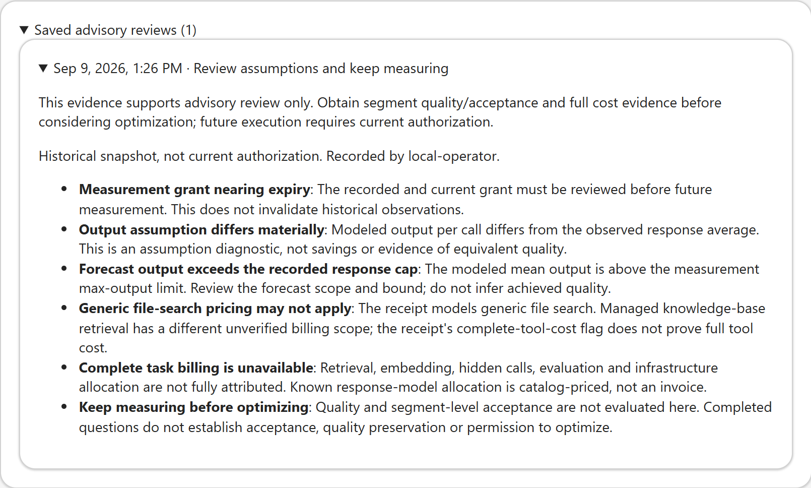

*Figure 23. A saved September 9 review retains its original findings; it is not
rewritten to reflect September 14.*

There is **one saved advisory review**, recorded by **local-operator**. Its old
wording says the grant was *nearing expiry*, while today's live finding says
*expired*. That is expected: immutable historical evidence and a current
assessment answer different questions.

Saving a new review would append an actor-attributed snapshot, not publish policy,
run questions or train the predictor. **Saved quality reviews**, when applicable
to compatible acceptance evidence, are separate from advisory reviews. They are
not decision-grade evidence available for this metrics-only batch.

## 15. Project history and optional Work IQ evidence

At the bottom of **Performance & Decisions**, expand **Project history:
reconciliation, learning and other workloads**.

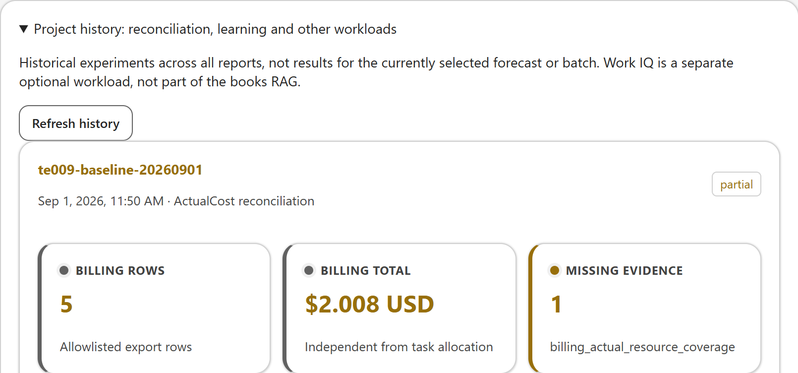

*Figure 24. Historical experiment evidence remains accessible without occupying
Home or being mistaken for the current batch. The screenshot shows the beginning
of the expanded history.*

The current history includes an older September 1 reconciliation, an unchanged
learning proof and a separate **m365-calendar-count** portability experiment.
Those records do not belong to the selected September 9 ten-question batch.

In particular, the older learning proof shows **121.6% before and after WAPE** on
120 measured tasks. That is not the current batch's WAPE; the current batch has
no eligible calibration samples and unavailable WAPE.

**Work IQ is optional and not part of this books RAG.** The historical
calendar-count experiment demonstrates a different workload using reusable
contracts. Its one accepted task and independent ground-truth comparison do not
establish statistical sufficiency or known Copilot Credit consumption for RAG.

**Why this screen matters:** history supports auditability and portability without
letting unrelated success, acceptance rates or billing totals contaminate the
current report's conclusions.

## 16. Safe walkthrough and current limitations

For a demonstration using saved evidence only:

1. Open `RPT-20260908-CA037FE9` from Home.
2. Keep Forecast 3, prediction 5176, selected; inspect profile, economics and infrastructure.
3. Read Effective policy, its measurement expiry and Change requests without creating a draft.
4. Open Execute & Review and review Run 3; do not prepare or run questions.
5. Open Performance & Decisions with the same completed batch selected.
6. Expand comparison, billing/learning, WAPE help, findings, saved review and Project history.

Do not use Create report, Save report, Create revised forecast, forecast
confirmation, policy-authoring/publication, Run, Record usage feedback,
Sync billing & reconcile, or Save advisory review as part of a read-only tour.
Some do not spend model tokens, but they still change evidence or authority.

| Current state | Consequence |
|---|---|
| Hosted Foundry-only release | Other delivery routes are visible future-release options, not available hosted integrations. |
| Expired measurement grant | No new batch is authorized by that historical grant. |
| Hosted review integration needs setup | The protected proposal-to-publication path requires operator configuration; page visibility is insufficient. |
| Billing source networking remains restricted | Existing imported evidence is readable; successful fresh hosted sync is not demonstrated. |
| No segment acceptance outcomes for this batch | Completed responses cannot support a quality-preserving optimization claim. |
| Partial cost and no exact response prediction contract | No complete-task bill, accepted-task unit economics or calibrated improvement is established. |

The hosted service has separate process liveness and persistent-storage readiness.
A healthy application does not imply an active execution grant, accessible billing
source or accepted-task evidence. If report data becomes unavailable, do not
recreate reports, clear evidence or change Azure security settings to make a
demonstration look complete; the operator should investigate the dependency.
Deployment decision D95 records an outstanding governance-owner dependency for
durable persistence availability.

### Alignment with the full TokenEconomics lifecycle

This guide documents the existing **predict -> compare policy -> admit -> execute
-> evaluate -> respond -> reconcile -> learn** responsibilities; it does not claim
that every link is proven by this one batch. It consumes versioned saved receipts,
policy provenance, sealed response measurements, billing snapshots and feedback.
Its outputs are documentation and screenshots, not new runtime or decision evidence.

The current example demonstrates saved forecasting, Azure authority inspection,
historically authorized measurement, response-economics review, advisory findings
and partial reconciliation/feedback. Complete-trajectory costs, segment-specific
acceptance, representative tail-risk evidence, authorized regression/reversion
proof and improved held-out future predictions remain gaps against the
[constitution's completion definition](09_TOKENECONOMICS_CONSTITUTION.md#6-definition-of-aligned-completion).
No savings, quality preservation or production-validated optimization is guaranteed.

## 17. Evidence references and terminology

### Exact example binding

| Evidence | Identifier |
|---|---|
| Report | `RPT-20260908-CA037FE9` |
| Latest forecast | `e997e27b-ac11-49c6-bbf9-bdc8eb3c9bd6` |
| Prediction | `5176` |
| Original receipt | `plan_3c01293376656dbf20cd` |
| Completed batch | `run-f87aa8eae8ef4c57a05a6defb5da9b79` |
| Batch contract | `rag-agent-batch.v2` |
| Recorded/current policy version at capture | `2026-09-09.measurement.1` |

**Modeled** means calculated under stated assumptions. **Measured** means recorded
usage at its documented scope. **Proposed** means not yet authoritative.
**Partial** means known evidence with explicit gaps. **Unavailable** is not zero.
**Advisory** is not admission, accepted-task evaluation or policy publication.
**Production-validated** is not the classification of this reference walkthrough.

### Source documents and implementation

- [TokenEconomics Constitution](09_TOKENECONOMICS_CONSTITUTION.md), especially lifecycle, authority, immutable evidence and aligned completion.
- [Decision log](decision.md): D87-D91 for the current workflow; D92 for billing/response learning; D93-D94 for deployment and hosted route scope; D95 for current readiness and remaining operational dependencies.
- [Studio UI](../studio.html): screen labels, controls, rendering and WAPE help.
- [Studio API](../studio.py): read/write boundaries and hosted delivery enforcement.
- [Performance evidence](../rag/performance_evidence.py) and [advisory review](../costgov/performance_review.py): selected-batch interpretation.
- [Batch feedback](../rag/batch_feedback.py), [billing ingestion](../costgov/billing_ingestion.py) and [response learning](../costgov/response_learning.py): source joins, allocation and eligibility.
- [Microsoft Copilot Credits research](how-does-copilot-credits-and-its-consump.md): separate meter families and source references; not a claim of hosted route availability.
- [Microsoft Learn: create and manage Cost Management exports](https://learn.microsoft.com/en-us/azure/cost-management-billing/costs/tutorial-export-acm-data): billing exports as a source, separate from workload allocation.

Screenshots use the Standard appearance and are stored in
`docs/images/token-studio-guide/2026-09-14/`. Displayed values may be rounded.
Later policy, pricing, billing or report revisions can change current views;
historical receipts and sealed results retain their original meaning.
